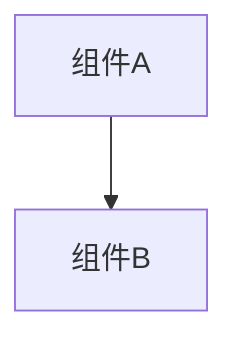

# 变更提案: mysql_port_expose_configurable

## 元信息
```yaml
类型: 优化
方案类型: implementation
优先级: P1
状态: ✅已完成
创建: 2026-01-28
```

---

## 1. 需求

### 背景
当前 `docker-compose.yml` 中 MySQL 未暴露到宿主机端口（仅容器网络可访问）。在以下场景不方便：
- 本机/其他主机上的工具需要直接连 MySQL（迁移/排障/导入导出）
- 需要把 MySQL 暴露到内网供其他服务连接（由运维侧控制访问）

### 目标
- MySQL 宿主机端口映射可配置
- 默认对外监听（绑定所有地址，而非 `127.0.0.1`）
- 同步更新文档与开发辅助脚本（避免“文档说改 compose 文件”的不一致）

### 约束条件
```yaml
安全约束: 对外暴露 MySQL 属于高风险操作，需要在文档中明确防火墙/内网/强口令建议，并提供“一键改回仅本机监听”的配置项
```

### 验收标准
- [x] `docker compose config` 校验通过
- [x] 文档明确：默认暴露端口、如何改端口、如何改回仅本机监听（安全提示）
- [x] `make dev` 自动拉起 MySQL 时，端口检测逻辑能跟随 `.env` 里的 MySQL 端口配置

---

## 2. 方案

### 技术方案
1) `docker-compose.yml`：为 `mysql` 服务新增 `ports` 映射，宿主端口用环境变量控制（默认 3306）  
2) `.env.example` / `docs/USAGE.md` / `README.md`：补充 `MYSQL_HOST_PORT`（以及可选 `MYSQL_BIND_IP`）的说明，并强调安全风险  
3) `scripts/dev-mysql.sh`：默认端口检测改为读取 `MYSQL_HOST_PORT`（保持 `REALMS_DEV_MYSQL_PORT` 仍可覆盖）

### 影响范围
```yaml
涉及模块:
  - 部署/运维: MySQL 端口暴露与可配置项
  - 开发体验: make dev 的 MySQL 自动拉起
预计变更文件: 4~6
```

### 风险评估
| 风险 | 等级 | 应对 |
|------|------|------|
| MySQL 端口暴露到公网导致被扫描/爆破 | 高 | 默认强提示；建议只在内网使用；必要时设置 `MYSQL_BIND_IP=127.0.0.1` 或用防火墙限制来源 IP；务必修改 root 密码/创建最小权限账号 |

---

## 3. 技术设计（可选）

> 涉及架构变更、API设计、数据模型变更时填写

### 架构设计


### API设计
#### {METHOD} {路径}
- **请求**: {结构}
- **响应**: {结构}

### 数据模型
| 字段 | 类型 | 说明 |
|------|------|------|
| {字段} | {类型} | {说明} |

---

## 4. 核心场景

> 执行完成后同步到对应模块文档

### 场景: {场景名称}
**模块**: {所属模块}
**条件**: {前置条件}
**行为**: {操作描述}
**结果**: {预期结果}

---

## 5. 技术决策

> 本方案涉及的技术决策，归档后成为决策的唯一完整记录

### mysql_port_expose_configurable#D001: 使用 MYSQL_HOST_PORT 控制宿主端口映射
**日期**: 2026-01-28
**状态**: ✅采纳
**背景**: 需要让部署侧在不改 compose 文件的情况下调整 MySQL 暴露端口。
**选项分析**:
| 选项 | 优点 | 缺点 |
|------|------|------|
| A: 直接改 `docker-compose.yml` 端口 | 无需新增变量 | 文档易过时；升级时容易冲突 |
| B: 通过 `.env` 变量 `MYSQL_HOST_PORT` 控制 | 部署侧可配置；与 `REALMS_HTTP_PORT` 风格一致 | 增加一个变量 |
**决策**: 选择方案 B
**理由**: 以配置优先，避免频繁改 compose 文件造成冲突；便于运维固化部署参数。
**影响**: 影响 docker compose 与文档/脚本说明。
