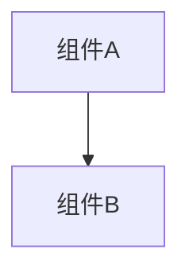

# 变更提案: make_dev_dual_local_docker_self

## 元信息
```yaml
类型: 优化
方案类型: implementation
优先级: P1
状态: ✅已完成
创建: 2026-01-28
```

---

## 1. 需求

### 背景
希望用一条 `make dev` 同时跑两套环境，便于对比与联调：
- 本地：正常模式（非自用模式），用于开发/热重载
- Docker：自用模式，用于快速验证 self_mode 下的裁剪与行为差异

### 目标
- `make dev` 同时启动：
  - 本地进程：端口 `8080`，正常模式
  - Docker 容器：端口 `7080`，自用模式（`REALMS_SELF_MODE_ENABLE=true`）
- 两套环境数据库分离（互不影响）

### 约束条件
```yaml
兼容性约束:
  - 不改变现有 `docker-compose.yml` 的部署用途（仍可单独用于 mysql+realms 部署）
  - `make dev` 在未安装 docker 时仍应至少能跑本地（降级提示）
```

### 验收标准
- [x] `make dev` 启动后：
  - 本地可访问 `http://127.0.0.1:8080/`
  - Docker self 可访问 `http://127.0.0.1:7080/`
- [x] Docker self 与本地环境数据库互不影响（使用独立 docker compose project/volume 或独立 DB）
- [x] `go test ./...` 通过，`docker compose config` 通过

---

## 2. 方案

### 技术方案
1) 调整 `scripts/dev.sh`：在启动本地 `air` 前，额外 `docker compose -p <dev-project>` 拉起一套 self_mode 的 `mysql + realms`（独立 project，避免与部署容器/数据卷冲突），并固定宿主端口 `7080`  
2) 本地进程强制使用 `8080` 且 `REALMS_SELF_MODE_ENABLE=false`  
3) Docker self 的 MySQL 使用独立 project，避免与本地 MySQL 冲突：为该 project 指定不同的 `MYSQL_HOST_PORT`（例如 `7306`）  
4) 更新 `Makefile` help/注释与相关文档，说明双环境用法与端口/变量

### 影响范围
```yaml
涉及模块:
  - 开发体验: make dev 一键双环境
  - 部署脚本: dev.sh 逻辑调整
预计变更文件: 2~4
```

### 风险评估
| 风险 | 等级 | 应对 |
|------|------|------|
| Docker self 的 MySQL 端口与本地 MySQL 冲突 | 中 | 为 dev project 固定使用不同宿主端口（默认 `7306`） |
| 用户机器未安装 docker 导致 `make dev` 失败 | 低 | 检测后跳过 docker self，并输出提示 |

---

## 3. 技术设计（可选）

> 涉及架构变更、API设计、数据模型变更时填写

### 架构设计


### API设计
#### {METHOD} {路径}
- **请求**: {结构}
- **响应**: {结构}

### 数据模型
| 字段 | 类型 | 说明 |
|------|------|------|
| {字段} | {类型} | {说明} |

---

## 4. 核心场景

> 执行完成后同步到对应模块文档

### 场景: make dev 双环境
**模块**: 开发体验
**条件**: 本地安装 Go 与 air；Docker 可选（未安装 Docker 时会跳过 self_mode 容器）
**行为**: 执行 `make dev`
**结果**:
- 本地正常模式：监听 `:8080`
- Docker self_mode：监听 `:7080`，并使用独立 docker compose project（数据库隔离）

---

## 5. 技术决策

> 本方案涉及的技术决策，归档后成为决策的唯一完整记录

### make_dev_dual_local_docker_self#D001: docker self 使用独立 docker compose project
**日期**: 2026-01-28
**状态**: ✅采纳
**背景**: 需要保证 docker self 与现有部署（或本地 MySQL）互不干扰，并确保数据库隔离。
**选项分析**:
| 选项 | 优点 | 缺点 |
|------|------|------|
| A: 同 project 复用同一套 compose | 简单 | 容器/volume 冲突，数据库不隔离 |
| B: 使用 `docker compose -p realms-dev-self` 独立 project | 数据隔离且可并行运行 | 多一套容器占用资源 |
**决策**: 选择方案 B
**理由**: 最小侵入地达成“并行运行 + 数据库隔离”，且不影响部署用途。
**影响**: 影响 `make dev` 启动逻辑与文档说明。
