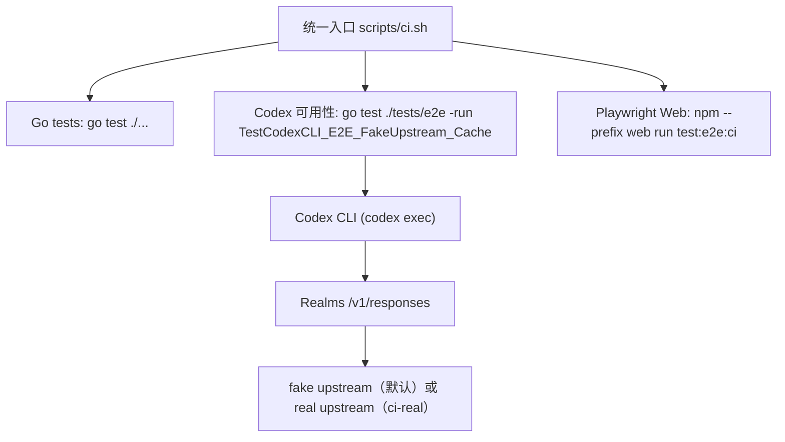

# 变更提案: testing-unify-codex-playwright

## 元信息
```yaml
类型: 重构
方案类型: implementation
优先级: P1
状态: ✅完成
创建: 2026-02-16
```

---

## 1. 需求

### 背景
当前项目测试入口与 CI（GitHub Actions）存在多处“分散拼装”的现状，导致：
- 本地与 CI 跑的检查集不一致，复现成本高
- 同一个 E2E/冒烟目标被拆在多个 job/脚本/命令里，维护困难
- CI 强依赖真实上游 Secrets（含额外 curl preflight），容易造成不必要的波动与门槛

你期望明确的治理方向：
- **测试可用性（E2E/冒烟）统一使用 Codex CLI 作为客户端**
- **前端问题测试统一使用 Playwright**（覆盖组件级与交互级）
- **本地/CI 使用相同检查集**
- **GitHub Actions 主工作流提供统一入口**

### 目标
1) 定义并落地“可用性检查集”（端到端/冒烟）的统一入口：本地与 CI 执行同一套命令
2) 后端可用性验证：以 **Codex CLI** 触发真实请求链路（Codex CLI → Realms → Upstream），默认使用 **fake upstream/seed** 保证稳定
3) 前端验证：以 **Playwright** 作为唯一测试工具，覆盖“组件级（页面内组件交互）+ 交互级（跨页面流程）”
4) CI 分层：主 CI 默认不依赖真实上游 Secrets；额外提供“真实上游集成”工作流用于手动/定时验证

### 约束条件
```yaml
时间约束: 无硬性
性能约束: 主 CI 需要可接受的执行时间（不引入明显的分钟级膨胀）
兼容性约束: 本地与 CI（Ubuntu）同口径；本地需明确工具前置条件（go/node/codex/playwright）
业务约束: 不引入生产行为变更；不删除现有测试/脚本（允许弃用与文档降级）
```

### 验收标准
- [ ] 主 CI 入口统一：`.github/workflows/ci.yml` 仅调用一个统一入口（`make ci` 或 `scripts/ci.sh`）
- [ ] 本地/CI 同检查集：使用同一入口命令可复现 CI 的 E2E/冒烟（seed/fake upstream）
- [ ] 后端可用性测试仅使用 Codex CLI 客户端（不再以 curl 作为可用性验收口径）
- [ ] 前端测试仅使用 Playwright，新增至少 1 个“组件级/交互级”用例用于覆盖关键交互
- [ ] 主 CI 不强依赖真实上游 Secrets（fork/无 secrets 环境可通过）；另提供可选 real-upstream 工作流
- [ ] README 与知识库同步更新，明确测试分层、入口、环境变量与执行方式

---

## 2. 方案

### 技术方案
采用“**统一入口脚本 + CI 分层**”：

- 新增统一入口（建议 `scripts/ci.sh`）封装以下检查集（本地/CI 相同）：
  - Go：`go test ./...`（保持现有）
  - Codex 可用性（fake upstream）：执行 `go test ./tests/e2e -run TestCodexCLI_E2E_FakeUpstream_Cache -count=1`（测试内部通过 `codex exec` 作为客户端）
  - Web（seed）：执行 `npm --prefix web ci` + `npm --prefix web run test:e2e:ci`（Playwright）

- GitHub Actions 主工作流：
  - 仅做基础环境准备（Go/Node/Codex/Playwright chromium）
  - 只调用统一入口脚本（不再在 YAML 内拼装多段测试命令）
  - 不再强制真实上游（移除 `REALMS_*_UPSTREAM_*` 强依赖与 curl preflight）

- 真实上游集成验证（可选）：
  - 新增 `ci-real` 工作流（`workflow_dispatch` + 可选 `schedule`）
  - 复用现有 real upstream 逻辑（Codex + Playwright real），但不阻塞主 CI

### 影响范围
```yaml
涉及模块:
  - .github/workflows: CI 入口与 job 结构调整
  - scripts/: 新增统一入口脚本（以及可选的 real 入口脚本）
  - Makefile: 增加统一目标（可选）
  - tests/e2e: Codex 可用性测试作为主线被统一入口调用（必要时微调）
  - web/e2e: 补齐组件级/交互级用例
  - README.md / web/README.md / helloagents/modules: 文档同步
预计变更文件: 6-12
```

### 风险评估
| 风险 | 等级 | 应对 |
|------|------|------|
| 主 CI 默认不跑真实上游，可能遗漏上游兼容问题 | 中 | 新增 `ci-real` 工作流做手动/定时真实上游验证 |
| Playwright 安装/浏览器依赖导致 CI 不稳定 | 中 | CI 固定 chromium；仅在 CI 使用 `--with-deps`；失败上传 report |
| Codex CLI 未安装导致可用性测试失败 | 低 | CI 显式安装；统一入口对缺失给出清晰错误 |
| 统一入口脚本跨平台差异（本地环境） | 低 | 明确前置条件；脚本保持 POSIX/bash 兼容，必要时提供替代说明 |

---

## 3. 技术设计（可选）

> 涉及架构变更、API设计、数据模型变更时填写

### 架构设计


（本变更不涉及对外 API 或数据模型变更）

---

## 4. 核心场景

> 执行完成后同步到对应模块文档

### 场景: 主 CI（默认 seed/fake upstream）
**模块**: CI/Testing
**条件**: 无真实上游 Secrets
**行为**: 运行统一入口（`make ci` / `scripts/ci.sh`）
**结果**: Go 测试通过 + Codex 可用性通过 + Playwright（seed）通过

### 场景: 真实上游集成验证（可选）
**模块**: CI/Testing
**条件**: 仓库注入真实上游 Secrets
**行为**: 手动/定时触发 `ci-real` 工作流
**结果**: Codex/Playwright 真实链路可用，作为集成回归信号

---

## 5. 技术决策

> 本方案涉及的技术决策，归档后成为决策的唯一完整记录

### testing-unify-codex-playwright#D001: 主 CI 默认使用 seed/fake upstream（推荐）
**日期**: 2026-02-16
**状态**: ✅采纳
**背景**: 主 CI 当前强依赖真实上游与 Secrets，导致波动与复现门槛；同时你要求本地/CI 同检查集、可用性用 Codex CLI、前端用 Playwright。
**选项分析**:
| 选项 | 优点 | 缺点 |
|------|------|------|
| A: 主 CI 默认 seed/fake upstream + 额外 ci-real | 稳定、无 secrets 也可跑；本地可 1:1 复现；主入口更简单 | 主 CI 不覆盖真实上游兼容 |
| B: 主 CI 强制真实上游（现状延续） | 覆盖真实链路 | 强依赖 secrets；flake 风险高；本地复现门槛高 |
**决策**: 选择方案 A
**理由**: 先把“统一入口 + 同口径 + 可复现”落地作为主线质量基座；真实上游作为可选集成回归，减少日常噪音但不放弃覆盖。
**影响**: `.github/workflows/*`、`scripts/*`、`README.md`、`web/e2e/*`、`tests/e2e/*`
