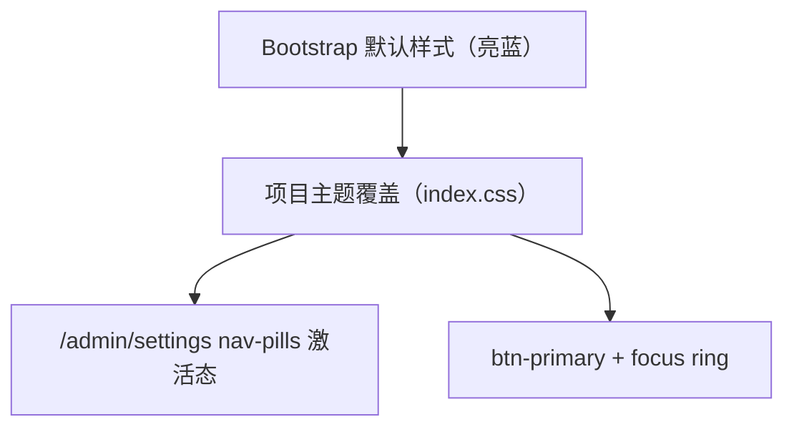

# 变更提案: light-green-theme

## 元信息
```yaml
类型: 修复
方案类型: implementation
优先级: P1
状态: 完成
创建: 2026-02-19
```

---

## 1. 需求

### 背景
`/admin/settings` 页面仍存在 Bootstrap 默认的亮蓝色“按钮态”（典型表现为 `nav-pills` 激活态/按钮强调态呈现蓝色），与当前项目希望的浅绿色主题不一致。

### 目标
- 将管理后台（尤其是 `/admin/settings`）的“主强调色”统一为浅绿色主题，不再出现默认亮蓝色。
- 让 `nav-pills` 的激活态与 `btn-primary` 的主按钮态一致命中主题色（含 hover/active/focus）。

### 约束条件
```yaml
时间约束: 无
性能约束: 无（纯样式调整）
兼容性约束: 保持 Bootstrap 5.3.2 兼容
业务约束: 仍保留 danger/warning 等语义色，不将所有颜色“涂绿”
```

### 验收标准
- [√] `/admin/settings` 的 tabs（`nav-pills`）激活态不再是亮蓝色，且命中主题主色
- [√] `btn-primary` 不出现亮蓝色（含 focus ring）
- [√] `npm -C web run check:theme` 通过
- [√] `npm -C web run build` + `npm -C web run test:e2e:ci -- e2e/theme-colors.spec.ts` 通过

---

## 2. 方案

### 技术方案
- 在 `web/src/index.css` 中统一主题主色为更“浅绿”的绿色系，并补齐对 Bootstrap `nav-pills` 激活态的全局覆盖（避免落回默认亮蓝色）。
- 同步更新 Playwright 主题回归测试的断言，使其校验“非亮蓝 + 命中当前主题主色”。

### 影响范围
```yaml
涉及模块:
  - web: 主题 CSS 变量与组件状态样式（按钮/导航 pills）
  - e2e: 主题回归断言更新
预计变更文件: 2-4
```

### 风险评估
| 风险 | 等级 | 应对 |
|------|------|------|
| 主色调整导致局部对比度不足 | 中 | 选择足够深的主色；保留 hover/active 更深档；重点检查按钮文字与 pills |
| 仅修复 `/admin/settings`，其他页面仍出现默认蓝 | 低 | 采用全局 `nav-pills` 覆盖而非页面级补丁 |

---

## 3. 技术设计（可选）

> 涉及架构变更、API设计、数据模型变更时填写

### 架构设计


（本变更无 API / 数据模型调整）

---

## 4. 核心场景

> 执行完成后同步到对应模块文档

### 场景: `/admin/settings` tabs 激活态
**模块**: web
**条件**: 进入 `/admin/settings`，存在 `nav nav-pills`
**行为**: 点击任意 tab
**结果**: 激活态背景色/文字色命中主题主色，不出现默认亮蓝色

---

## 5. 技术决策

> 本方案涉及的技术决策，归档后成为决策的唯一完整记录

### light-green-theme#D001: 全局覆盖 `nav-pills` 激活态以避免默认亮蓝色
**日期**: 2026-02-19
**状态**: ✅采纳
**背景**: Bootstrap 默认 `nav-pills` 激活态可能呈现亮蓝色；仅在局部页面修补会遗漏其他入口。
**选项分析**:
| 选项 | 优点 | 缺点 |
|------|------|------|
| A: 仅对特定页面写 CSS（如 `.simple-header .nav-pills`） | 改动最小 | 容易遗漏（如 `/admin/settings`），问题复现概率高 |
| B: 全局覆盖 `.nav-pills` 激活态（推荐） | 一次性根治，确保所有 pills 命中主题色 | 影响面更广，需要简单回归 |
**决策**: 选择方案 B
**理由**: 本问题属于主题一致性问题，应该在主题层统一处理而非页面打补丁。
**影响**: `web/src/index.css` 的 `nav-pills` 样式与相关测试断言
