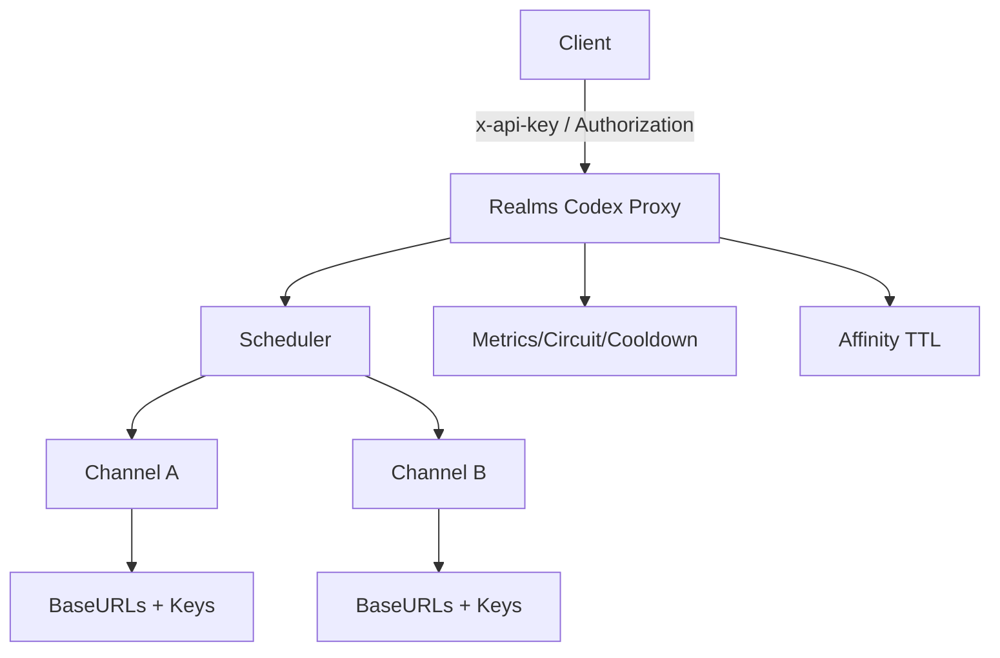

# 技术设计: Codex API 中转（Responses / Chat Completions / Models / /v1/*）

## 技术方案

### 核心技术
- **语言:** Go（建议 1.22+）
- **HTTP:** 标准库 `net/http`（或后续如需可替换为 Gin，但优先保持依赖最小）
- **配置:** JSON/YAML（二选一，推荐 JSON 以降低解析依赖；最终以实现阶段决定）

### 方案对比（复杂任务强制对比）

#### 方案1（最小依赖 net/http-推荐）
- **说明:** 使用 `net/http` 自建 router + middleware，手写转发与 SSE flush。
- **优点:** 依赖最少、行为透明、易于排障；适合“中转网关”这种 IO 密集型服务。
- **缺点:** 路由/中间件需要自己组织；代码组织要求更严格，否则会变得凌乱。

#### 方案2（Gin 对齐参考项目）
- **说明:** 使用 Gin 复刻 `claude-proxy` 的 handler/middleware 组织方式。
- **优点:** 与参考项目结构接近，复用思路更直接；中间件生态成熟。
- **缺点:** 引入额外依赖；在“纯代理”场景下并非必需。

> 推荐选择方案1，保持实现“简单、无魔法”。如你更看重对齐参考项目，可切换到方案2（实现步骤基本一致）。

### 实现要点（复用 claude-proxy 结论）
三层 failover（**Channel → BaseURL → API Key**）：
1. **Channel 选择（scheduler）**：促销期 > Trace 亲和 > priority 顺序；失败切下一个渠道；兜底选失败率最低。
2. **BaseURL 选择（url_manager）**：同一渠道多个 `baseUrls` 动态排序；失败进入冷却并沉底，冷却后再尝试。
3. **API Key 选择（key_manager/metrics）**：按顺序尝试；失败进入冷却；配额类失败可降权（移到队尾）。

错误分类（fuzzyMode）：
- **Normal:** 按状态码 + 错误体关键词决定是否 failover；不可重试错误（内容审核等）禁止重试。
- **Fuzzy:** 所有非 2xx 都尝试 failover，但仍需识别不可重试错误。

## 架构设计

## 架构决策 ADR

### ADR-001: 采用三层 failover（Channel→BaseURL→Key）
**上下文:** 需要同时解决“渠道级宕机、端点抖动、单 key 配额/限流”三类失败。  
**决策:** 采用与 `claude-proxy` 一致的三层 failover 结构，并将“选择渠道”与“实际转发重试循环”解耦。  
**替代方案:** 仅做单层 failover（只切换渠道或只切换 key） → 拒绝原因: 无法覆盖常见故障模式。  
**影响:** 实现复杂度提升，但可控；需要明确流式请求的 failover 边界。

### ADR-002: 流式请求的 failover 边界
**上下文:** SSE 一旦开始输出，重试会导致重复/语义错误。  
**决策:** 仅在“未向客户端写入任何响应（头/体）之前”允许 failover；一旦开始写回即固定本次选择。  
**替代方案:** 流式中断后自动续流/重放 → 拒绝原因: 需要上游支持可重放语义，且难以保证一致性。

### ADR-003: 统一转发 `/v1/*`，并重点验证 `/v1/responses`、`/v1/chat/completions`、`/v1/models`
**上下文:** 需求明确包含 responses/chat-completions/models，其他接口不确定但希望可扩展。  
**决策:** 以通用 `/v1/*` 转发为主；用测试覆盖 responses/chat-completions/models（含 SSE）。  
**替代方案:** 为每个接口单独写 handler → 拒绝原因: 维护成本高，且需求不明确（YAGNI）。

## API 设计

### 认证
- 代理访问密钥：优先从 `x-api-key` 读取；否则从 `Authorization: Bearer <key>` 读取。

### 对外接口（代理透传）
- `ANY /v1/*`：转发至选中的 upstream（重点支持 `/v1/responses`、`/v1/chat/completions`、`/v1/models`）

### 内部接口（建议）
- `GET /healthz`：健康检查（可不鉴权或使用单独密钥；以实现阶段决定）

## 数据模型
默认内存结构（MVP）：
- key 指标：最近 N 次成功/失败结果（滑窗），用于熔断判定
- key 冷却：失败时间戳 + 次数，用于短期跳过
- url 状态：连续失败次数 + 最后失败时间，用于动态排序
- affinity：user_id → channelIndex + lastUsedAt（TTL）

## 安全与性能
- **安全:**
  - 默认开启请求体大小限制（防止大包打爆内存）
  - 默认脱敏日志（不输出 key 明文/完整请求体）
  - 若允许自定义 baseUrl：提供 SSRF 防护（例如：域名白名单/重定向校验）
- **性能:**
  - 复用 `http.Transport` 与连接池
  - SSE 采用 `io.Copy` + `Flush`，避免缓冲导致延迟

## 测试与部署
- **测试:**
  - 使用 `httptest` 构造上游：模拟 5xx/429/网络错误，验证 key→url→channel 的切换顺序
  - SSE：模拟 event-stream，验证透传与 flush（覆盖 `/v1/responses` 与 `/v1/chat/completions`）
- **部署:**
  - 单二进制部署；配置文件 + 环境变量覆盖
  - 推荐以容器方式运行（可选）
