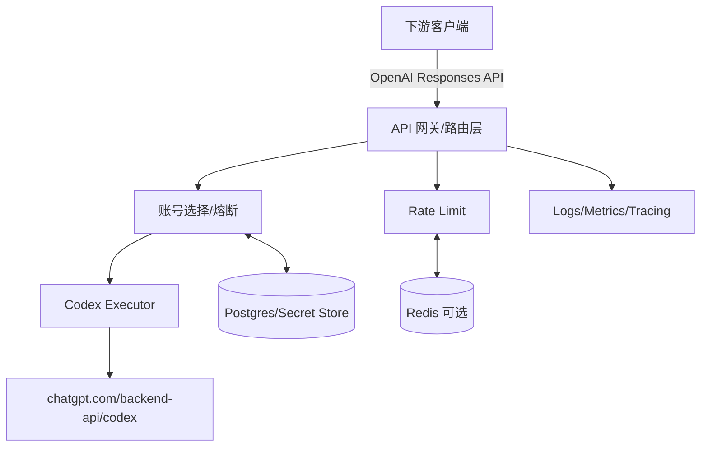

# 技术设计: Codex Responses 企业级中转服务

## 技术方案

### 核心技术
- **语言:** Go（优先标准库 `net/http`，保持可维护与低依赖）
- **配置:** 环境变量 + YAML（支持热更新/滚动发布）
- **存储:** Postgres（凭据/账号状态/审计索引），Redis（分布式限流与临时状态，可选）
- **可观测性:** OpenTelemetry（trace/metrics），结构化日志（JSON）
- **部署:** 容器化 + Kubernetes（或等价云容器平台）

### 实现要点

#### 1) 对外 OpenAI Responses API（数据面）

- 入口：
  - `POST /v1/responses`（支持 `stream=true` SSE）
  - `GET /v1/models`
- 扩展（按兼容性需要逐步实现）：
  - `GET /v1/responses/{id}`
  - `DELETE /v1/responses/{id}`
  - `POST /v1/responses/{id}/cancel`
  - `POST /v1/responses/{id}/compact`
  - `GET /v1/responses/{id}/input_items`
  - `POST /v1/responses/{id}/input_tokens`

策略：先把 Codex CLI 关键路径跑通（create + stream），再按客户/工具需要补齐其余端点。

#### 2) 上游 Codex 调用（执行器）

默认上游：
- Base URL：`https://chatgpt.com/backend-api/codex`
- Endpoint：`POST /responses`

Header 注入（由服务端统一补齐，客户端无需了解）：
- `Authorization: Bearer <access_token>`
- `Openai-Beta: responses=experimental`
- `Originator: codex_cli_rs`（OAuth 模式）
- `Chatgpt-Account-Id: <chatgpt_account_id>`（从 id_token 或元数据获得）
- `Version` / `Session_id` / `User-Agent` 等（用于与 Codex 上游兼容）

流式转发：
- 客户端 `stream=true`：直接透传 SSE
- 客户端 `stream=false`：可选策略
  - A：上游请求 `stream=false`（若上游支持且行为稳定）
  - B：上游统一 `stream=true`，服务端聚合到 `response.completed` 后返回

#### 3) OAuth 凭据接入（云端可用）

约束：OpenAI/Codex OAuth 的 `redirect_uri` 可能固定为 `http://localhost:1455/auth/callback`（不受我们控制），因此云端接入必须提供“可操作的桥接方案”。

支持三种 onboarding（按安全优先级排序）：
1. **导入 auth cache（推荐）**：管理员在受信环境完成登录后，将 `~/.codex/auth.json` 通过管理 API 安全导入
2. **Device Code Flow（如可用）**：服务端生成 device code，管理员在浏览器完成绑定（headless 友好）
3. **SSH 隧道/复制回调 URL（兜底）**：按指引建立端口转发，将浏览器回调导入到云端实例

token 刷新：
- 统一后台刷新（提前 `refresh_lead`），并在请求路径上做“缺失/过期兜底刷新”
- 并发控制：同一账号刷新用单飞（singleflight）/分布式锁，避免风暴

#### 4) 多账号轮询与熔断

账号状态（最小字段）：
- `status`: ready / cooling / disabled
- `next_retry_at`: 冷却到期
- `last_error`: 最近错误（脱敏）
- `backoff_level`: 指数退避等级
- `models_allowed/excluded`: 可用模型集（可选）

选择策略（默认 round-robin）：
- 只选 `ready` 且模型允许的账号
- 遇到上游 429/403/5xx/网络错误：标记冷却，递增 backoff，并切换账号重试（有上限）
- 定期健康探测：冷却到期后先小流量探测再恢复

#### 5) 限流（企业级最小可用）

下游限流维度（至少一个）：
- per API key（或 per tenant）

上游保护维度：
- per OAuth 账号（防止单账号被打爆）

实现：
- 单实例：内存 token bucket
- 多实例：Redis 分布式 token bucket（推荐）

#### 6) 日志脱敏、审计与观测

日志脱敏（默认强制）：
- 永不记录：`Authorization`、`refresh_token`、`access_token`、`id_token`、Cookie
- 请求体：默认不落盘；如需要排障，提供“采样 + 字段级白名单 + 过期清理”

审计事件（建议）：
- 记录：时间、租户/API key、模型、响应状态码、耗时、选用账号（仅索引/哈希）
- 不记录：用户输入内容、模型输出全文（除非明确启用并合规）

可观测性：
- 关键指标：QPS、p95/p99 延迟、429/5xx 比例、账号冷却数量、刷新失败率
- tracing：请求链路（含 upstream span）

## 架构设计



## 架构决策 ADR

### ADR-001: 采用 Go + 标准库优先
**上下文:** 需要高并发 SSE、可控依赖、易运维  
**决策:** Go 实现，HTTP 层优先 `net/http`，必要时引入轻量路由  
**理由:** 简单可维护；性能与并发模型成熟；可复用既有 Go 生态  
**替代方案:** Node.js/Java → 拒绝原因: 依赖与复杂度更高（在当前目标下不划算）  
**影响:** 初期开发效率高；后续可平滑扩展

### ADR-002: 云端 onboarding 以“导入 auth cache / device code”为主
**上下文:** `redirect_uri=localhost` 限制使云端直接回调不可用  
**决策:** 以导入 `~/.codex/auth.json` 为默认，device code 为首选 headless 方案，SSH 隧道为兜底  
**理由:** 可操作且安全边界清晰；避免在云端暴露不必要的交互面  
**替代方案:** 自建 redirect_uri → 拒绝原因: 无法控制官方 OAuth client_id/redirect 配置  
**影响:** 需要管理面与导入流程；但更符合企业落地

### ADR-003: 限流采用 Redis（多实例）+ 内存（单实例）双模式
**上下文:** 云部署通常多副本，需要一致限流  
**决策:** 抽象 limiter 接口，默认 Redis；无 Redis 则退化为单实例内存限流  
**理由:** 满足企业部署现实；同时保留本地开发简洁性  
**替代方案:** 只做内存限流 → 拒绝原因: 多副本下不可靠  
**影响:** 引入 Redis 依赖（可选）

## API设计（对外）

### POST /v1/responses
- **请求:** OpenAI Responses create request（JSON）
- **响应:** `stream=false` 返回 response object；`stream=true` 返回 SSE event stream

### GET /v1/models
- **响应:** OpenAI models list response（支持 alias 与过滤）

## 数据模型（建议）

```sql
-- oauth_accounts：加密存储 token + 状态
-- rate_limit_policies：按租户/键限流
-- audit_events：审计索引（脱敏）
```

## 安全与性能

- **安全:**
  - 凭据加密存储（KMS/Secret Manager 或主密钥轮换）
  - 管理面强认证（SSO/RBAC），数据面 API key / mTLS（按企业要求）
  - 全链路脱敏与最小化采集
- **性能:**
  - SSE 直通减少拷贝
  - 连接/超时参数可配
  - 上游连接池与重试（有上限，避免放大故障）

## 测试与部署

- **测试:**
  - 协议兼容测试（Responses/Models）
  - 流式稳定性测试（断连/取消/超时）
  - 轮询与熔断测试（模拟 429/5xx）
  - 脱敏与审计测试（确保 token 不落盘）
- **部署:**
  - 容器镜像 + Helm（或 Terraform/Cloud Run 等）
  - 配置与密钥分离；滚动发布；灰度开关

