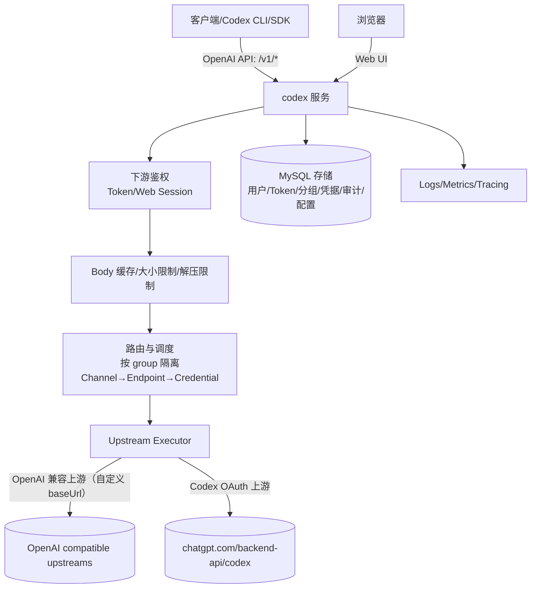

# 技术设计: codex（统一中转服务）

## 技术方案

### 核心技术
- **语言:** Go（建议 1.22+）
- **HTTP:** 优先标准库 `net/http`（依赖最小、行为透明，适合网关/代理）
- **配置:** YAML + 环境变量覆盖（实现阶段可根据依赖偏好调整为 JSON）
- **可观测性:** 结构化日志（JSON）；可选 OpenTelemetry（按部署复杂度决定）

### 设计要点（从调研中提炼）
1. **SSE 需要“真的流式”**：逐事件转发与 flush，避免读完再写回（Codex CLI 会表现为卡住后整段输出）。
2. **请求体可复用**：中转通常需要“解析/校验一次 + 转发/重试”，需缓存 body 并可重置读取。
3. **体积限制要覆盖解压后**：防 zip bomb；同时避免 SSE 响应 gzip 压缩破坏流式语义。
4. **failover 分层**：Channel → Endpoint(BaseURL) → Credential(Key/Account)，并有跨请求冷却与滑窗熔断（参考 claude-proxy）。
5. **会话粘性 + 均衡**：Codex OAuth 账号池引入 routeKey 粘性（TTL=30min，临时存储）与 rolling RPM 负载均衡；失败先重试 3 次（所有错误）再重绑，且仅在写回前允许切换。

## 架构设计



## 架构决策 ADR

### ADR-001: 最终只保留一个服务：`codex`
**上下文:** 现有方案包拆分导致重复与分叉，难以落地与维护。  
**决策:** 合并为单体服务 `codex`，在同一代码库内通过配置启用/禁用能力。  
**替代方案:** 分拆为 gateway + auth-service + relay-service → 拒绝原因: 早期复杂度过高（YAGNI）。  
**影响:** 需要更清晰的模块边界（auth/router/executor/store/obs），避免单体变“泥球”。

### ADR-002: 对外接口以 OpenAI 兼容为主，重点覆盖 `responses/models/chat`
**上下文:** Codex CLI 与常见 SDK 需要稳定的 OpenAI 风格北向接口。  
**决策:** 北向实现 `POST /v1/responses`（含 SSE）、`POST /v1/chat/completions`（含 SSE）与 `GET /v1/models`；其他 `/v1/*` 视需要做通用转发。  
**替代方案:** 每个端点单独写 handler → 拒绝原因: 维护成本高且需求边界未完全明确。  
**影响:** 需要明确“通用转发”与“协议适配”两类 handler 的差异与优先级。

### ADR-003: 采用三层 failover（Channel → Endpoint → Credential）
**上下文:** 需要同时覆盖渠道级宕机、端点抖动、单凭据配额/限流三类故障模式。  
**决策:** 采用 claude-proxy 的三层模型，并将“选择 Channel”与“请求重试回路”解耦。  
**替代方案:** 只切换 channel 或只切换 key → 拒绝原因: 覆盖面不足。  
**影响:** 需要严格定义“不可重试错误”与“流式写回后的重试禁止”。

### ADR-004: SSE 流式请求的 failover 边界
**上下文:** SSE 一旦开始写回，重试会导致重复输出/语义不一致，甚至重复计费。  
**决策:** 仅在“未向下游写入任何响应（header/body）之前”允许 failover；一旦开始写回即固定本次上游选择。  
**替代方案:** 流式中断后续流/重放 → 拒绝原因: 需要上游可重放语义且难以保证一致性。  
**影响:** 需要在代码层面显式维护 `response_started` 状态。

### ADR-005: 上游类型与合规边界
**上下文:** 需要同时支持 Codex OAuth 与 OpenAI 兼容的自定义 baseUrl 上游，请求形态保持 OpenAI Responses/Chat 兼容。  
**决策:** 采用混合模式：上游包含 `codex_oauth` 与 `openai_compatible` 两类 channel。  
**实现约束（安全默认）:**
- 自定义 `baseUrl` 默认仅允许管理员配置（配置文件或管理后台/API），不允许在普通用户请求中直接传入任意 URL（避免 SSRF/内网探测）。
- 对可配置 baseUrl 启用 SSRF 防护（例如：白名单/重定向校验；可选严格模式）。
**替代方案:** 允许用户请求携带任意 baseUrl → 拒绝原因: 高风险且难以治理。  
**影响:** 需要在配置层区分 channel type，并在执行器层封装两类上游的鉴权/header 注入与错误分类。

### ADR-006: Web 控制台采用服务端渲染（SSR），不做 2FA/OAuth
**上下文:** 需要 Web 控制台，但需求明确不需要 2FA/OAuth；同时希望依赖最小、落地快。  
**决策:** Web 端使用 `html/template` 服务端渲染 + 少量 JS；账号密码登录 + Cookie 会话；管理员权限用角色控制。  
**替代方案:** SPA + Node 构建链路 / OAuth / 2FA → 拒绝原因: 复杂度与运维成本显著增加，且非当前需求。  
**影响:** 必须补齐：密码安全哈希、会话过期/登出、CSRF 防护、注册/登录限速与审计。

### ADR-007: 数据面鉴权使用用户 Token（多 Token/可撤销），仅存 hash
**上下文:** 需要兼容 OpenAI 风格调用（Codex CLI/SDK），并支持一个用户多个 Token。  
**决策:** 数据面统一采用 `Authorization: Bearer <token>`（可选 `x-api-key`）；Token 明文只在创建时展示一次；库内仅存 hash（建议 HMAC-SHA256 + pepper）。  
**替代方案:** Token 明文入库 / bcrypt/argon2 存 Token → 拒绝原因: 风险高或浪费资源（Token 为高熵随机串）。  
**影响:** 需要安全管理 pepper，并支持 hash 版本以便后续轮换；上游凭据加密所需主密钥仅从环境/密钥管理注入（不入库、不进日志）。

### ADR-008: 分组隔离默认严格，不跨组 fallback
**上下文:** 分组隔离为强需求；用户/Token/上游资源必须按组隔离。  
**决策:** 用户绑定 `group_id`；Token 继承组；调度/路由仅在组内资源集合中选择，默认不跨组 fallback。  
**替代方案:** 跨组重试/共享资源池 → 拒绝原因: 容易引入越权与计费语义混乱。  
**影响:** 调度器入口必须显式接收 `group_id`，并在管理后台对“组-资源绑定”做校验与审计。

### ADR-009: 配额来自套餐/订阅（对接点），以接口隔离实现
**上下文:** 配额来源确认来自套餐/订阅，但套餐逻辑仍在实现中。  
**决策:** 定义 `QuotaProvider` 对接接口，数据面请求前置校验配额；套餐模块完成后接入真实实现。  

**口径（已确认）:**
- 计量: 成本（`usd_micros`）
- 定价表: 管理员维护/控制
- 时间窗: rolling 5h / 7d / 30d（相对时间）
- 订阅周期: 相对月（按购买时间 + 1 month）
- 绑定: 用户账号（`user_id`，来源于数据库）
- 叠加: 并行（多订阅额度汇总）
- 超额: 直接拒绝（提示“余额不足”，无需返回额外字段）

**替代方案:** 现在就做完整计费/支付闭环 → 拒绝原因: 超出当前范围，且依赖未就绪。  
**影响:** 需要落地“成本计算”（tokens→cost + 定价表）与 rolling window 统计（事件表）；按套餐配置的 rolling window 采用“预估→预留→结算”避免穿透；流式开始写回后即视为可计费（客户端断开仍结算），无 usage 且未写回则计费=0。

## 分组隔离细则（实现约束）

### 1) `group_id` 的唯一来源
- **数据面（/v1/*）:** 只从鉴权后的 `user_tokens.group_id` 获取；请求体/Query/Header 不允许传入或覆盖 `group_id`
- **Web/管理后台:** 只从登录会话对应的 `users.group_id` 获取；用户不可自行修改分组
- **一致性校验（建议）:** 校验 `users.group_id == user_tokens.group_id`，不一致直接拒绝（避免用户被迁组后旧 Token 仍跨组可用）

### 2) 上游资源的分组绑定与选择
- 上游资源是**服务器侧**配置：`upstream_channels.group_id` 是权威分组；`upstream_endpoints`/`credentials`/`codex_oauth_accounts` 通过外键继承该分组
- 调度/路由的第一步必须是**按 `group_id` 过滤候选集**，然后再做 `Channel → Endpoint → Credential` 选择
- `GET /v1/models` 返回应以 `group_id` 为边界（组内可见模型集合）；不应暴露组外模型/渠道存在性

### 3) 缓存/亲和/粘性必须带 `group_id`
- `TraceAffinity` key 建议：`group_id:user_id`
- `SessionBinding` key 建议：`group_id:route_key_hash`
- 任何“跨请求复用”的状态（冷却、熔断、RPM）不应绕过分组过滤（通常由 `credential_id` 隐含分组）

### 4) 管理边界（最小角色模型）
- **普通用户:** 仅管理自己的 Token；仅查看自己的配额/用量；不能操作上游资源与其他用户
- **group admin:** 仅管理本组用户/本组上游（channels/endpoints/credentials/accounts）；不能跨组
- **root:** 可管理所有分组与上游资源；可维护定价表/全局策略（仍需严格审计）

## API 设计

### 认证（下游）
- 数据面（OpenAI 风格接口）：默认支持 `Authorization: Bearer <token>`（兼容 Codex CLI/SDK）
- 可选支持 `x-api-key: <token>`
- Web 控制台：账号密码登录 + Cookie 会话（SSR）
- 鉴权失败返回统一错误体（不泄漏策略细节）

### 对外接口（数据面）
- `POST /v1/responses`（stream true/false）
- `GET /v1/models`
- `POST /v1/chat/completions`（用于 `wire_api=chat`）
- `GET /healthz`（可选鉴权策略）

### 控制面（管理接口，建议默认关闭）
Web 控制台提供用户与管理能力（不做 2FA/OAuth），核心接口（以实现阶段为准）：
- `GET /login` / `POST /login`、`GET /register` / `POST /register`、`POST /logout`
- `GET /api/me`、`GET /api/tokens`、`POST /api/tokens`、`POST /api/tokens/{id}/revoke`
- `POST /admin/users`、`PATCH /admin/users/{id}`、`POST /admin/groups`、`PATCH /admin/groups/{id}`
- `POST /admin/upstreams/channels`、`PATCH /admin/upstreams/channels/{id}`（`type=codex_oauth|openai_compatible`）
- `POST /admin/upstreams/channels/{id}/endpoints`、`PATCH /admin/upstreams/endpoints/{id}`
- `POST /admin/upstreams/endpoints/{id}/openai-keys`、`POST /admin/upstreams/openai-keys/{id}/revoke`
- `POST /admin/upstreams/endpoints/{id}/codex-oauth/import`、`GET /admin/upstreams/codex-oauth/accounts`、`POST /admin/upstreams/codex-oauth/refresh`

> 管理后台必须强认证（管理员角色）并严格审计；必要时将管理入口仅绑定内网或独立域名。

## 数据模型（建议）

### 运行态内存模型（MVP）
- `TraceAffinity`：`group_id:user_id` → `channel_id`（TTL）
- `SessionBinding`：`group_id:route_key_hash` → `credential_id`（TTL=30min，命中成功后 touch）
- `RPM`：`credential_id` → rolling RPM（窗口 60s）
- `KeyCooldown`：credential → `next_retry_at` / `fail_count`
- `URLState`：base_url → `fail_count` / `last_fail_at`
- `RecentResults`：滑窗结果（用于熔断/健康判定）

### 持久化（MySQL）
持久化使用 MySQL（已确认），建议最小表集合：
- `users`：用户与状态（enabled/disabled、role、group_id、plan_id 等）
- `groups`：分组（租户）
- `user_tokens`：用户 Token（仅存 hash；一个用户多个 Token；支持撤销/过期）
- `user_sessions`：Web 会话
- `email_verifications`：邮箱验证码（预留；邮件能力完成后用于注册强制验证）
- `upstream_channels`：上游渠道（`codex_oauth`/`openai_compatible`），与 `group_id` 绑定（用于分组隔离）
- `upstream_endpoints`：上游端点（baseUrl 列表，隶属 `upstream_channels`）
- `openai_compatible_credentials`：OpenAI 兼容上游的 API key（加密存储，隶属 `upstream_endpoints`）
- `codex_oauth_accounts`：Codex OAuth 账号（token 加密存储、刷新元数据、冷却状态；隶属 `upstream_endpoints`）
- `audit_events`：审计索引（不含输入内容与明文凭据）

OpenAI 兼容上游（自定义 baseUrl）与 Codex OAuth 上游同级，均作为服务器侧上游资源管理；baseUrl/api_key 仅允许管理员配置（管理后台/管理 API），不允许普通用户在请求中直接传入任意 URL（避免 SSRF/内网探测）。

最小字段建议（示例，最终以实现阶段为准）：

```sql
CREATE TABLE upstream_channels (
  id BIGINT PRIMARY KEY AUTO_INCREMENT,
  group_id BIGINT NOT NULL,
  type VARCHAR(32) NOT NULL, -- codex_oauth | openai_compatible
  name VARCHAR(64) NOT NULL,
  status TINYINT NOT NULL DEFAULT 1, -- 1=enabled, 0=disabled
  priority INT NOT NULL DEFAULT 0,
  created_at DATETIME NOT NULL,
  updated_at DATETIME NOT NULL
);

CREATE TABLE upstream_endpoints (
  id BIGINT PRIMARY KEY AUTO_INCREMENT,
  channel_id BIGINT NOT NULL,
  base_url VARCHAR(255) NOT NULL,
  status TINYINT NOT NULL DEFAULT 1,
  priority INT NOT NULL DEFAULT 0,
  created_at DATETIME NOT NULL,
  updated_at DATETIME NOT NULL,
  KEY idx_channel_id (channel_id)
);

CREATE TABLE openai_compatible_credentials (
  id BIGINT PRIMARY KEY AUTO_INCREMENT,
  endpoint_id BIGINT NOT NULL,
  name VARCHAR(128) NULL,
  api_key_enc BLOB NOT NULL,
  api_key_hint VARCHAR(32) NULL,
  status TINYINT NOT NULL DEFAULT 1,
  last_used_at DATETIME NULL,
  created_at DATETIME NOT NULL,
  updated_at DATETIME NOT NULL,
  KEY idx_endpoint_id (endpoint_id)
);

CREATE TABLE codex_oauth_accounts (
  id BIGINT PRIMARY KEY AUTO_INCREMENT,
  endpoint_id BIGINT NOT NULL,
  account_id VARCHAR(64) NOT NULL,
  email VARCHAR(255) NULL,
  access_token_enc BLOB NOT NULL,
  refresh_token_enc BLOB NOT NULL,
  id_token_enc BLOB NULL,
  expires_at DATETIME NULL,
  last_refresh_at DATETIME NULL,
  status TINYINT NOT NULL DEFAULT 1,
  cooldown_until DATETIME NULL,
  last_used_at DATETIME NULL,
  created_at DATETIME NOT NULL,
  updated_at DATETIME NOT NULL,
  KEY idx_endpoint_id (endpoint_id)
);
```

敏感字段加密（建议）：
- 采用应用层加密（主密钥从环境变量/密钥管理注入），对 refresh_token/access_token/api_key 等字段做加密后入库。

## 配额与计费（套餐/订阅 rolling window，MVP）

本节目标：把“套餐/订阅的 rolling window（例如 5h/7d/30d）额度”落到可执行的计费/扣费规则，并明确“上游未计费=本地不计费”的判定口径。

### 1) 计费信号优先级（避免拍脑袋）
1. **上游返回 `usage`（优先）**：以 `usage.input_tokens/usage.output_tokens` 为准，按定价表计算 `usd_micros`。
2. **上游未返回 `usage` 但已开始写回响应（SSE/非流式均可）**：视为“上游已产生成本”，按**本地估算**结算（见下文“本地估算”）。
3. **无 `usage` 且未写回任何响应内容（例如：上游 4xx/5xx、超时、连接失败、被策略拒绝）**：计费 = 0（即“上游未计费=本地不计费”的最小可判定实现）。

> 说明：`codex_oauth` 作为非公开上游形态，`usage` 可用性不稳定；对外商用必须把“计费来源（usage/estimate）”写入审计与对账数据，避免纠纷时无法解释。

### 2) rolling window 的“预留→结算”状态机（避免最后一笔穿透）
**问题：** 只在请求结束时落账（post-charge）会出现并发穿透：同一时间多个请求都看到“余额够”，最后一起结算导致超额。

**MVP 解法：** 参考 new-api 的思路，采用“预留（reserve）→结算（commit）→作废（void/expire）”：
- `reserved`：请求进入时，按“上限预估成本”预留额度（计入窗口占用）。
- `committed`：请求结束时，根据 `usage` 或本地估算得到 `final_usd_micros`，将预留转为最终消耗（差额可返还）。
- `void`：请求在**写回前**失败/被拒绝/无法形成计费信号，预留作废（计费=0）。
- `expired`（实现上可归并为 `void`）：服务异常导致预留未结算，超过 `reserve_expires_at` 后自动作废，避免用户被“卡死”。

**关键规则：**
- 一旦 `response_started=true`（已向下游写入任何 header/body/SSE 事件），该请求**必须进入结算**（客户端中途断线也结算）。
- `reserve_expires_at` 建议 = `started_at + max_request_duration + grace`（例如 +2min），由后台清理任务回收。

### 3) 定价表（管理员维护 + 模型倍率）
**表：`pricing_models`（建议按 group 维度隔离）**
- 目标：支持“参考官网价格 + 管理员手动倍率（markup/discount）”
- 建议存储：全部用整数表示，避免 float 累积误差
  - `input_usd_micros_per_million`、`output_usd_micros_per_million`：每 1M tokens 的微美元价格
  - `multiplier_ppm`：倍率（parts-per-million），`1_000_000 = 1.0`

示例（最终以实现阶段为准）：
```sql
CREATE TABLE pricing_models (
  id BIGINT PRIMARY KEY AUTO_INCREMENT,
  group_id BIGINT NOT NULL,
  model_pattern VARCHAR(128) NOT NULL, -- 精确名或通配（如 gpt-4o-*）
  input_usd_micros_per_million BIGINT NOT NULL,
  output_usd_micros_per_million BIGINT NOT NULL,
  multiplier_ppm BIGINT NOT NULL DEFAULT 1000000,
  status TINYINT NOT NULL DEFAULT 1, -- 1=enabled, 0=disabled
  created_at DATETIME NOT NULL,
  updated_at DATETIME NOT NULL,
  UNIQUE KEY uniq_group_model (group_id, model_pattern),
  KEY idx_group_status (group_id, status)
);
```

### 4) 用量/计费事件表（用于 rolling window 与对账）
**表：`usage_events`**
- 一条请求至少对应一条记录（`request_id` 唯一）
- 既记录预留也记录最终结算：通过 `status` 决定本条计入窗口的金额

示例（最终以实现阶段为准）：
```sql
CREATE TABLE usage_events (
  id BIGINT PRIMARY KEY AUTO_INCREMENT,
  request_id VARCHAR(64) NOT NULL,
  group_id BIGINT NOT NULL,
  user_id BIGINT NOT NULL,
  token_id BIGINT NOT NULL,
  is_stream TINYINT NOT NULL DEFAULT 0,
  response_started TINYINT NOT NULL DEFAULT 0,
  upstream_type VARCHAR(32) NOT NULL, -- codex_oauth | openai_compatible
  upstream_endpoint_id BIGINT NULL,
  upstream_credential_id BIGINT NULL,
  model VARCHAR(128) NOT NULL,
  pricing_source VARCHAR(16) NOT NULL, -- usage | estimate | none
  input_tokens INT NOT NULL DEFAULT 0,
  output_tokens INT NOT NULL DEFAULT 0,
  total_tokens INT NOT NULL DEFAULT 0,
  reserved_usd_micros BIGINT NOT NULL DEFAULT 0,
  final_usd_micros BIGINT NOT NULL DEFAULT 0,
  status VARCHAR(16) NOT NULL, -- reserved | committed | void
  reserve_expires_at DATETIME NULL,
  error_code VARCHAR(64) NULL,
  started_at DATETIME NOT NULL,
  ended_at DATETIME NULL,
  created_at DATETIME NOT NULL,
  updated_at DATETIME NOT NULL,
  UNIQUE KEY uniq_request (request_id),
  KEY idx_user_ended (user_id, ended_at),
  KEY idx_token_ended (token_id, ended_at),
  KEY idx_user_status_exp (user_id, status, reserve_expires_at),
  KEY idx_status_exp (status, reserve_expires_at)
);
```

### 5) rolling window 计算口径（按套餐配置）
在请求进入时，`QuotaProvider` 需要按“套餐当前生效的 window”计算“已占用额度 + 本次预留”是否超额：
- `spent_committed = SUM(final_usd_micros) WHERE status='committed' AND ended_at >= NOW() - INTERVAL <window>`
- `spent_reserved = SUM(reserved_usd_micros) WHERE status='reserved' AND reserve_expires_at > NOW()`
- `spent_total = spent_committed + spent_reserved`
- 若 `spent_total + reserve_usd_micros > window_limit_usd_micros` → 拒绝（“余额不足”）

### 6) 本地估算（usage 缺失时的最小可用方案）
当 `usage` 缺失但 `response_started=true`：
- **输入 tokens**：优先用入站请求的本地估算（已在网关解析阶段完成）
- **输出 tokens**：从已转发的流式事件/非流式 body 中提取文本，估算 token 数（MVP 可先用近似 estimator；后续可换更精确的 tokenizer）
- 计费记录必须标记 `pricing_source='estimate'`，以便对账与争议处理

> 约束：必须配合“默认 max_output_tokens + 最大请求时长”，否则本地估算会被无限拉长，直接突破 5h 套餐窗口。

## 安全与性能
- **请求安全:**
  - 请求体大小限制（含解压后）
  - body 可复用缓存（避免重试时丢 body）
  - SSRF 防护（当 baseUrl 可配置时，建议启用白名单/重定向校验等策略）
- **敏感信息:**
  - 永不记录：`Authorization`、`refresh_token`、`access_token`、`id_token`、Cookie
  - 请求体默认不落盘；排障需显式开启采样与有效期清理
- **Web 安全:**
  - 密码安全哈希（实现阶段选型 argon2id/bcrypt）
  - CSRF 防护、登录/注册限速、会话过期与主动注销
  - 开发期开放注册的开关与环境隔离（生产默认禁用“无验证码注册”）
- **SSE:**
  - 禁止对 SSE 响应 gzip 压缩
  - 逐事件 flush；可选 ping 保活；写回后禁止 failover（仅在写回前允许重试/重绑；绑定账号先重试 3 次，所有错误都重试）
- **性能:**
  - 复用 `http.Transport`，合理的连接池/超时配置
  - 上游重试有上限，避免放大故障

## 测试与部署
- **测试:**
  - 调度器单测：promotion/affinity/priority/fallback
  - failover 集成测试：credential→url→channel 切换（覆盖 5xx/429/网络错误）
  - SSE 透传测试：事件边界与 flush（覆盖 `/v1/responses` 与 `/v1/chat/completions`）
  - 脱敏测试：确保 token 不出现在日志/审计
- **部署:**
  - 单二进制或容器部署
  - 配置文件 + 环境变量覆盖；滚动发布

## 已确认结论（关键决策摘要）
1. **上游类型:** `codex_oauth` + `openai_compatible`（OpenAI 兼容上游通过自定义 baseUrl 渠道接入）
2. **自定义 baseUrl:** 仅管理员配置（管理后台/API + 落库），不允许普通用户在请求中传入任意 URL
3. **存储:** MySQL（敏感字段应用层加密）
4. **北向协议:** 同时支持 `responses` 与 `chat`（并保留 `GET /v1/models`）
5. **下游体系:** Web 控制台（SSR）+ 多用户 + 多 Token（数据面鉴权，Token 仅存 hash）
6. **分组隔离:** 默认严格隔离，不跨组 fallback
7. **注册策略:** 开发期开放注册；邮件能力完成后强制邮箱验证
8. **配额:** 来源于套餐/订阅（对接点预留，套餐模块实现中）
9. **限流:** 暂不实现（后续如有需要再补充）
