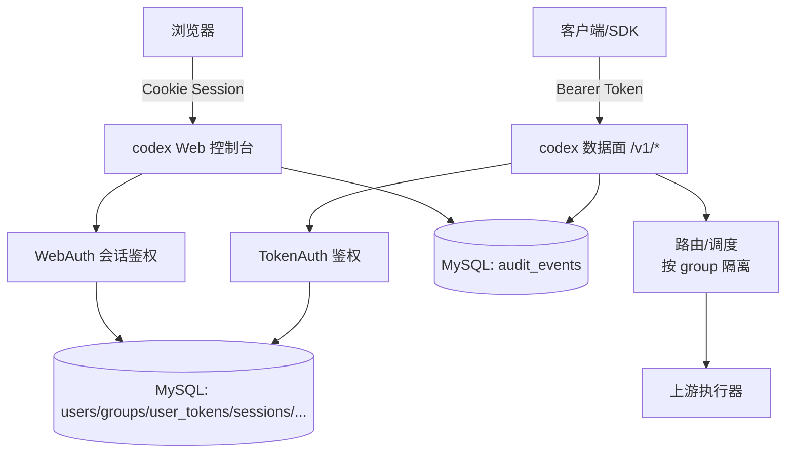

# 技术设计: user-system（用户体系）

## 技术方案

### 核心技术
- **语言:** Go（与 `codex` 主方案一致）
- **数据:** MySQL
- **鉴权形态:**
  - Web 控制台：账号密码登录 + 会话 Cookie
  - 数据面：用户 Token（Bearer / `x-api-key`）
  - 管理后台：复用 Web 登录的管理员角色（不做 2FA/OAuth）

### Web UI 形态（推荐）
**已确认:** Go `html/template` 服务端渲染 + 少量 JS（KISS，避免引入 Node 构建链路）

### 实现要点（KISS）
1. **Token 多个/可撤销**：一个用户可创建多个 Token；撤销后立即失效；Token 明文只在创建时显示一次。
2. **分组隔离默认最严格**：用户归属一个分组；Token 继承分组；路由/调度只在组内选渠道/凭据/模型，不做跨组 fallback。
3. **配额来自套餐（对接点）**：定义 `QuotaProvider` 接口，套餐模块完成后接入；在此之前以“占位实现/固定套餐”跑通链路。
4. **邮箱验证先预置能力**：开发期允许注册不强制邮箱验证码；邮件能力实现后切换为“注册强制邮箱验证”。
5. **敏感信息不落盘明文**：Token 仅存 hash；密码使用安全哈希；日志/审计不含请求正文与明文凭据。

## 架构设计



## 架构决策 ADR

### ADR-001: Web 控制台采用账号密码 + Cookie 会话（不做 2FA/OAuth）
**上下文:** 需要 Web UI（控制台），但明确不需要 2FA/OAuth；目标是最小可用、可维护。  
**决策:** Web 端使用账号密码登录，建立 Cookie 会话；管理员权限通过用户角色控制。  
**理由:** 实现简单、用户心智低；不引入第三方登录与复杂安全面。  
**替代方案:** OAuth/2FA → 拒绝原因: 需求明确“不需要”，且安全/运维复杂度高。  
**影响:** 必须补齐：密码安全哈希、会话过期/注销、CSRF 防护、限速与审计。

### ADR-002: 数据面鉴权使用用户 Token（多 Token/可撤销），Token 只存 hash
**上下文:** 需要兼容 OpenAI 风格调用，且一个用户可有多个 Token；必须降低凭据泄漏风险。  
**决策:** 数据面统一采用 Token（Bearer/x-api-key）；仅存 `token_hash`，明文只在创建时展示一次。  
**理由:** Token 为高熵随机串，快速 hash + pepper 足够；撤销与轮换清晰。  
**替代方案:** 明文入库 / 慢 hash（bcrypt/argon2） → 拒绝原因: 风险高或浪费资源。  
**影响:** 需要安全管理 pepper（环境变量/密钥管理），并支持 hash 版本以便后续轮换。

### ADR-003: 分组隔离默认严格，不跨组 fallback
**上下文:** 分组隔离为强需求；上游渠道/凭据/模型等资源必须按组隔离。  
**决策:** 用户绑定一个 `group_id`；Token 继承组；路由/调度仅在组内选择资源，默认不跨组 fallback。  
**理由:** 最小化越权风险与心智成本。  
**替代方案:** 跨组重试（cross-group retry） → 拒绝原因: 破坏隔离语义，容易引入越权与计费混乱。  
**影响:** 需要在调度器入口明确传入 `group_id`，并在配置/管理后台做强校验。

## API 设计

### Web（控制台）
- `GET /`：控制台首页（未登录跳转登录页）
- `GET /login` / `POST /login`：登录
- `GET /register` / `POST /register`：注册（需要邮箱验证码）
- `POST /logout`：登出

### 数据面鉴权（OpenAI 风格接口）
- **首选:** `Authorization: Bearer <token>`
- **可选:** `x-api-key: <token>`
- **鉴权失败:** 返回统一错误体（不泄漏“用户是否存在/是否被禁用/是否 token 被撤销/过期”等细节）

### 控制面（管理接口）
> 不做单独 admin key：复用 Web 登录与管理员角色；必要时可将管理接口仅绑定内网或单独域名。

- `POST /admin/users`：创建用户（可选，若允许自助注册则主要用于管理）
- `PATCH /admin/users/{id}`：启用/禁用用户、调整分组/套餐绑定（以实现阶段为准）
- `POST /admin/groups` / `PATCH /admin/groups/{id}`：管理分组
- `GET /admin/audit`：查看审计（脱敏）

### 用户侧 API（供 Web UI 调用）
- `GET /api/me`：当前用户信息（含 group、套餐、配额概览）
- `GET /api/tokens`：Token 列表（脱敏展示，如仅展示前后缀）
- `POST /api/tokens`：创建 Token（明文仅返回一次）
- `POST /api/tokens/{id}/revoke`：撤销 Token
- `POST /api/email/verification`：发送注册验证码（邮件发送后置时按 dev-only 策略处理）

## 数据模型（建议）

> 字段为建议形态，最终以实现阶段为准；与 `codex` 主方案保持一致并在合并时统一命名。

```sql
-- users: 用户主体（登录用）
CREATE TABLE users (
  id BIGINT PRIMARY KEY AUTO_INCREMENT,
  email VARCHAR(255) NOT NULL,
  username VARCHAR(64) NULL,
  password_hash VARBINARY(255) NOT NULL,
  role INT NOT NULL DEFAULT 1, -- 1=user, 10=admin, 100=root（以实现阶段为准）
  group_id BIGINT NOT NULL,
  status TINYINT NOT NULL DEFAULT 1, -- 1=enabled, 0=disabled
  created_at DATETIME NOT NULL,
  updated_at DATETIME NOT NULL
);

-- plan_definitions: 套餐 SKU 与限额（按成本计量，单位 usd_micros）
CREATE TABLE plan_definitions (
  id BIGINT PRIMARY KEY AUTO_INCREMENT,
  sku VARCHAR(64) NOT NULL,
  limit_usd_micros_5h BIGINT NOT NULL,
  limit_usd_micros_week BIGINT NOT NULL,
  limit_usd_micros_month BIGINT NOT NULL,
  enabled TINYINT NOT NULL DEFAULT 1,
  created_at DATETIME NOT NULL,
  updated_at DATETIME NOT NULL,
  UNIQUE KEY uk_plan_sku (sku)
);

-- model_pricing: 模型定价表（管理员维护，单位 usd_micros / 1M tokens）
CREATE TABLE model_pricing (
  id BIGINT PRIMARY KEY AUTO_INCREMENT,
  model VARCHAR(128) NOT NULL,
  input_usd_micros_per_1m_tokens BIGINT NOT NULL,
  output_usd_micros_per_1m_tokens BIGINT NOT NULL,
  enabled TINYINT NOT NULL DEFAULT 1,
  created_at DATETIME NOT NULL,
  updated_at DATETIME NOT NULL,
  UNIQUE KEY uk_model_pricing_model (model)
);

-- user_subscriptions: 用户订阅（按月购买，支持并行叠加）
CREATE TABLE user_subscriptions (
  id BIGINT PRIMARY KEY AUTO_INCREMENT,
  user_id BIGINT NOT NULL,
  plan_id BIGINT NOT NULL,
  status TINYINT NOT NULL DEFAULT 1, -- 1=active, 0=revoked（过期按 ends_at 判定）
  starts_at DATETIME NOT NULL,
  ends_at DATETIME NOT NULL,
  source VARCHAR(32) NOT NULL DEFAULT 'admin_grant',
  created_at DATETIME NOT NULL,
  updated_at DATETIME NOT NULL,
  KEY idx_user_subscriptions_user_id (user_id),
  KEY idx_user_subscriptions_plan_id (plan_id),
  KEY idx_user_subscriptions_ends_at (ends_at)
);

-- user_usage_buckets: 用量分桶（rolling window 基础数据，按成本计量）
CREATE TABLE user_usage_buckets (
  id BIGINT PRIMARY KEY AUTO_INCREMENT,
  user_id BIGINT NOT NULL,
  bucket_type VARCHAR(16) NOT NULL, -- 例如 '5m'/'1h'（实现阶段定）
  bucket_start DATETIME NOT NULL,
  cost_usd_micros BIGINT NOT NULL,
  created_at DATETIME NOT NULL,
  updated_at DATETIME NOT NULL,
  UNIQUE KEY uk_usage_bucket (user_id, bucket_type, bucket_start),
  KEY idx_usage_user_id_bucket_start (user_id, bucket_start)
);

-- user_tokens: 数据面 Token（只存 hash）
CREATE TABLE user_tokens (
  id BIGINT PRIMARY KEY AUTO_INCREMENT,
  user_id BIGINT NOT NULL,
  group_id BIGINT NOT NULL,
  token_hash VARBINARY(32) NOT NULL,
  token_hash_version INT NOT NULL DEFAULT 1,
  name VARCHAR(128) NULL,
  status TINYINT NOT NULL DEFAULT 1, -- 1=active, 0=revoked, 0=disabled（以实现阶段为准）
  expired_at DATETIME NULL,
  last_used_at DATETIME NULL,
  created_at DATETIME NOT NULL,
  revoked_at DATETIME NULL,
  UNIQUE KEY uk_user_token_hash (user_id, token_hash),
  KEY idx_user_id (user_id)
);

-- user_sessions: Web 会话（cookie session id -> DB）
CREATE TABLE user_sessions (
  id BIGINT PRIMARY KEY AUTO_INCREMENT,
  user_id BIGINT NOT NULL,
  session_id VARBINARY(32) NOT NULL,
  expired_at DATETIME NOT NULL,
  created_at DATETIME NOT NULL,
  revoked_at DATETIME NULL,
  UNIQUE KEY uk_session_id (session_id),
  KEY idx_user_id (user_id)
);

-- email_verifications: 邮箱验证码（注册用，邮件发送能力可后置）
CREATE TABLE email_verifications (
  id BIGINT PRIMARY KEY AUTO_INCREMENT,
  email VARCHAR(255) NOT NULL,
  code_hash VARBINARY(32) NOT NULL,
  expired_at DATETIME NOT NULL,
  used_at DATETIME NULL,
  created_at DATETIME NOT NULL,
  UNIQUE KEY uk_email_active (email, expired_at)
);

-- groups: 分组（租户）
CREATE TABLE groups (
  id BIGINT PRIMARY KEY AUTO_INCREMENT,
  name VARCHAR(64) NOT NULL,
  status TINYINT NOT NULL DEFAULT 1,
  created_at DATETIME NOT NULL,
  updated_at DATETIME NOT NULL,
  UNIQUE KEY uk_group_name (name)
);

-- audit_events: 审计事件（索引字段，不含正文与明文凭据）
CREATE TABLE audit_events (
  id BIGINT PRIMARY KEY AUTO_INCREMENT,
  event_type VARCHAR(64) NOT NULL,
  actor_type VARCHAR(32) NOT NULL, -- admin/user/system
  actor_id BIGINT NULL,
  target_type VARCHAR(32) NULL, -- user/user_key
  target_id BIGINT NULL,
  request_id VARCHAR(64) NULL,
  ip VARCHAR(64) NULL,
  user_agent VARCHAR(256) NULL,
  result VARCHAR(16) NOT NULL, -- ok/deny/error
  created_at DATETIME NOT NULL,
  metadata JSON NULL
);
```

## 安全与性能
- **安全:**
  - Token 只存 hash（建议 HMAC + pepper）；比较使用常量时间函数
  - 密码安全哈希（argon2id/bcrypt，最终以实现阶段为准）
  - Web：CSRF 防护、登录/注册限速、会话过期与主动注销
  - 日志/审计默认脱敏：永不记录 `Authorization`/`x-api-key`/Cookie/密码/Token/请求正文
  - 分组隔离：默认拒绝跨组；管理后台变更分组/套餐必须审计
- **性能:**
  - 采用快速 hash 校验（对高熵 Token 足够），避免无谓的慢 hash 消耗
  - 鉴权缓存可选（后续需求驱动再做），避免过早优化

## 测试与部署
- **测试:**
  - Web 单测/集成：注册（含邮箱验证）、登录、登出、会话过期
  - Token 单测：创建/撤销/过期、Bearer/x-api-key
  - 隔离测试：跨组访问必须拒绝（模型/渠道/凭据）
  - 脱敏测试：确保 Token/密码/Cookie 不出现在日志与审计
- **部署:**
  - pepper/session secret 通过环境变量或密钥管理注入
  - 邮件发送能力后置时，生产默认禁用自助注册或强制真实邮件发送
