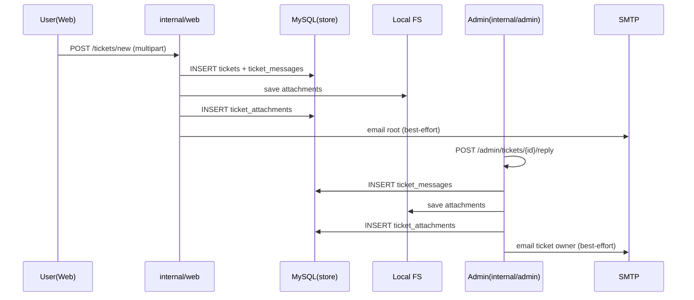

# 技术设计: 工单系统（工单 + 消息线程 + 附件）

## 技术方案

### 核心技术
- **后端:** Go `net/http`（沿用现有 SSR 控制台/管理后台结构）
- **模板:** `html/template`（自动 HTML 转义，降低 XSS 风险）
- **数据库:** MySQL（沿用 `internal/store/migrations/*.sql` 内置迁移）
- **邮件:** `internal/email`（SMTPMailer，复用 app_settings 覆盖机制）
- **附件存储:** 本地文件系统（服务端生成随机文件名 + DB 记录索引）

### 实现要点

1. **数据模型：工单/消息/附件三表**
   - `tickets`：工单主体（标题、状态、创建者、最后更新时间等）
   - `ticket_messages`：消息线程（用户/管理员的文本回复）
   - `ticket_attachments`：附件元信息（原始文件名、存储路径、大小、过期时间等）
   - 附件建议挂在 `ticket_messages` 上（便于表达“这条回复带了哪些附件”）

2. **路由与权限**
   - 用户侧（`internal/web`，需登录）：
     - `GET /tickets`：我的工单列表
     - `GET /tickets/new`：创建工单页
     - `POST /tickets/new`：创建工单（支持 multipart 附件）
     - `GET /tickets/{ticket_id}`：工单详情 + 时间线
     - `POST /tickets/{ticket_id}/reply`：追加回复（支持附件）
     - `GET /tickets/{ticket_id}/attachments/{attachment_id}`：下载附件（仅本人）
   - 管理侧（`internal/admin`，需 `root`）：
     - `GET /admin/tickets`：工单列表
     - `GET /admin/tickets/{ticket_id}`：工单详情
     - `POST /admin/tickets/{ticket_id}/reply`：管理员回复（支持附件）
     - `POST /admin/tickets/{ticket_id}/close`：关闭工单
     - `POST /admin/tickets/{ticket_id}/reopen`：恢复工单
     - `GET /admin/tickets/{ticket_id}/attachments/{attachment_id}`：下载附件（管理员）

3. **上传大小限制与 CSRF 顺序（关键）**
   - 现有 `middleware.CSRF()` 会在缺少 `X-CSRF-Token` 时调用 `r.ParseForm()`，对 multipart 请求可能会先读取 body。
   - **必须保证** 在任何 `ParseForm/ParseMultipartForm` 之前对请求加 `http.MaxBytesReader`，否则 100MB 限制会被绕过/延后到读完才失败。
   - 方案：为工单上传/回复路由单独定义 chain：
     - `SessionAuth` → `MaxBytesReader(总上限)` → `CSRF` → handler
   - 同时避免对上传请求使用 `middleware.BodyCache`（会把大 body 缓存进内存/磁盘，没必要且风险高）。

4. **附件本地存储规则**
   - 存储目录（建议可配置，默认值保证开箱即用）：
     - `tickets.attachments_dir`（默认 `./data/tickets`）
   - 文件名：仅使用服务端生成的随机 key（例如 `20260115/<rand>.bin`），不使用用户提供文件名
   - DB 记录保存：`original_name`（展示/下载名）、`content_type`、`size_bytes`、`sha256`（可选）、`storage_rel_path`、`expires_at`
   - 下载时：
     - 先做权限校验（用户必须是 ticket owner；管理员必须是 root）
     - `Content-Disposition: attachment; filename="<original_name>"`
     - `Content-Type` 以 DB 或 `http.DetectContentType` 为准（不要信任用户输入）

5. **附件过期清理（7 天 TTL）**
   - 创建附件时：`expires_at = NOW() + INTERVAL 7 DAY`
   - 后台定时清理（best-effort）：
     - 在 `internal/server/app.go` 增加 `ticketsAttachmentsCleanupLoop()`（例如每小时一次）
     - `store.ListExpiredTicketAttachments` 取出到期附件（包含存储路径）
     - 先删文件（忽略“文件不存在”），再删 DB 记录（或标记过期）
   - 失败策略：记录日志，不影响主流程

6. **邮件通知（best-effort）**
   - 新工单/用户回复：通知所有 `root` 用户（以 `users.role='root' AND status=1` 为收件人列表）
   - 管理员回复/关闭/恢复：通知工单创建者
   - 邮件配置：沿用现有逻辑（`app_settings` 覆盖 > `config.yaml` 默认值）
   - 失败策略：不回滚工单写入；页面可提示“已创建但邮件发送失败”，并记录日志

## 架构设计



## 架构决策 ADR

### ADR-001: 附件存储使用本地文件系统（采纳）
**上下文:** 需求要求“本地存储、1 周过期、最大 100MB”。  
**决策:** 附件落盘到本地目录，DB 仅存元信息与相对路径。  
**理由:** 实现简单、符合需求；避免 100MB 级别 BLOB 写入数据库带来的性能与备份压力。  
**替代方案:** DB BLOB 存储 → 拒绝原因: 成本高、风险大、备份与迁移痛苦。  
**影响:** 部署时需保证附件目录持久化（容器需挂载 volume）；需要定时清理任务。

### ADR-002: 工单采用“消息线程”模型（采纳）
**上下文:** 需求要求管理员可回复，用户也可持续补充信息，并支持附件。  
**决策:** 采用 `ticket_messages` 表记录时间线；附件挂在 message 上。  
**理由:** 简单直观、便于扩展（后续可加引用/系统消息/状态变更日志）。  
**替代方案:** 工单表仅存 `user_content/admin_reply` 两列 → 拒绝原因: 无法表达多轮往返与附件归属。

## API设计

本功能仅新增 SSR 控制台路由，不对外暴露数据面 API。

## 数据模型

（示意 SQL，最终以迁移文件为准）

```sql
CREATE TABLE `tickets` (
  `id` BIGINT PRIMARY KEY AUTO_INCREMENT,
  `user_id` BIGINT NOT NULL,
  `subject` VARCHAR(200) NOT NULL,
  `status` TINYINT NOT NULL DEFAULT 1,
  `last_message_at` DATETIME NOT NULL,
  `closed_at` DATETIME NULL,
  `created_at` DATETIME NOT NULL,
  `updated_at` DATETIME NOT NULL,
  KEY `idx_tickets_user_id_id` (`user_id`, `id`),
  KEY `idx_tickets_status_last_message_at` (`status`, `last_message_at`)
) ENGINE=InnoDB DEFAULT CHARSET=utf8mb4;

CREATE TABLE `ticket_messages` (
  `id` BIGINT PRIMARY KEY AUTO_INCREMENT,
  `ticket_id` BIGINT NOT NULL,
  `actor_type` VARCHAR(16) NOT NULL,
  `actor_user_id` BIGINT NULL,
  `body` TEXT NOT NULL,
  `created_at` DATETIME NOT NULL,
  KEY `idx_ticket_messages_ticket_id_id` (`ticket_id`, `id`)
) ENGINE=InnoDB DEFAULT CHARSET=utf8mb4;

CREATE TABLE `ticket_attachments` (
  `id` BIGINT PRIMARY KEY AUTO_INCREMENT,
  `ticket_id` BIGINT NOT NULL,
  `message_id` BIGINT NOT NULL,
  `uploader_user_id` BIGINT NULL,
  `original_name` VARCHAR(255) NOT NULL,
  `content_type` VARCHAR(255) NULL,
  `size_bytes` BIGINT NOT NULL,
  `sha256` VARBINARY(32) NULL,
  `storage_rel_path` VARCHAR(512) NOT NULL,
  `expires_at` DATETIME NOT NULL,
  `created_at` DATETIME NOT NULL,
  KEY `idx_ticket_attachments_ticket_id_id` (`ticket_id`, `id`),
  KEY `idx_ticket_attachments_expires_at` (`expires_at`)
) ENGINE=InnoDB DEFAULT CHARSET=utf8mb4;
```

## 安全与性能

- **安全:**
  - 上传前置 `http.MaxBytesReader`，避免超大 body 先被读取
  - 文件名与路径完全由服务端生成，避免路径穿越
  - 附件下载必须先通过 DB 查询并做权限校验
  - 模板渲染依赖 `html/template` 默认转义；用户输入限制长度（subject/body）
  - 邮件通知提示用户不要发送密钥/Token（并尽量避免把敏感内容原样发到邮件）
- **性能:**
  - 附件写入采用流式拷贝，不把文件读入内存
  - 列表查询走索引（`user_id,status,last_message_at`）
  - 清理任务按批次处理，避免单次扫描过大

## 测试与部署

- **测试:**
  - `go test ./...`
  - store 层：工单创建/查询/权限过滤；过期附件清理
  - handler 层：用户只能访问自己的；管理员可访问全部；上传大小限制生效；CSRF 对 multipart 生效
- **部署:**
  - 需要持久化 `tickets.attachments_dir` 目录（容器部署必须挂载 volume）
  - 生产环境建议配置更严格的 `limits.max_body_bytes`（数据面）与工单上传单独限制（控制台）

