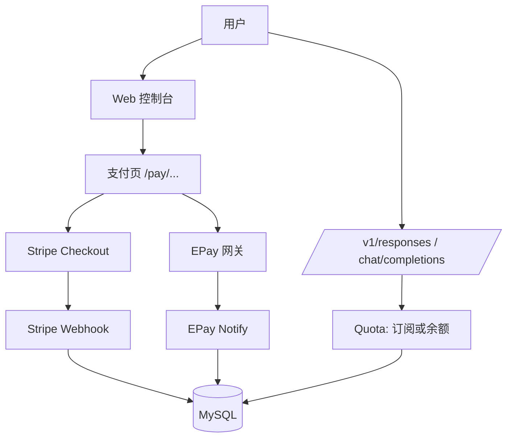

# 技术设计: 支付与按量计费（充值/订阅）

## 技术方案

### 核心技术
- Go 1.22（`net/http` + Go1.22 ServeMux 路由）
- MySQL（内置迁移）
- Stripe：`stripe-go`（Checkout Session + Webhook）
- EPay：复用 new-api 的实现思路（对接 EPay 网关 + notify 回调验签）

### 实现要点
- **配置来源：** `config.yaml` 提供默认值；`app_settings` 支持 UI 覆盖（优先级更高）
- **订单模型：**
  - 订阅订单沿用 `subscription_orders`，补齐“支付后更新状态并保留记录”的实现
  - 新增 `topup_orders` 与 `user_balances`，用于按量计费充值
- **按量计费：**
  - Reserve 阶段预留成本并扣减余额（防并发透支）
  - Commit 阶段按实际用量结算，多退少补
  - Void/Expired 阶段退回预留金额（避免余额被“吞”）

## 架构设计



## 架构决策 ADR

### ADR-006: 保留订阅订单表，新增充值订单表
**上下文:** 项目已存在 `subscription_orders`，但当前实现偏“审批后删除”，不利于支付回调与追溯；同时充值订单与订阅订单语义不同。
**决策:** 订阅订单继续使用 `subscription_orders`（改为状态更新并保留记录）；新增 `topup_orders` 管理充值订单；新增 `user_balances` 存储按量计费余额。
**替代方案:** 统一到单一 `payment_orders` 表 → 拒绝原因: 迁移成本更高，影响面更大，且与现有结构冲突。
**影响:** 数据模型更清晰；支付回调与审计更可追溯；实现复杂度可控。

## API设计（SSR + Webhook）

### 用户侧（需要登录）
- `GET /topup`：余额与充值订单页（创建充值订单入口）
- `POST /topup/create`：创建充值订单并跳转支付页
- `GET /pay/{kind}/{order_id}`：支付页（kind=subscription/topup）
- `POST /pay/{kind}/{order_id}/start`：发起支付并 302 跳转到支付渠道页面

### 支付回调（无需登录）
- `POST /api/pay/stripe/webhook`：Stripe Webhook（验签 + 幂等入账）
- `GET /api/pay/epay/notify`：EPay Notify（验签 + 幂等入账；按网关约定返回 success/fail）

## 数据模型

```sql
-- 用户余额（按量计费，单位 USD micros）
CREATE TABLE IF NOT EXISTS `user_balances` (
  `user_id` BIGINT PRIMARY KEY,
  `usd_micros` BIGINT NOT NULL DEFAULT 0,
  `created_at` DATETIME NOT NULL,
  `updated_at` DATETIME NOT NULL
) ENGINE=InnoDB DEFAULT CHARSET=utf8mb4;

-- 充值订单（支付成功后增加 user_balances）
CREATE TABLE IF NOT EXISTS `topup_orders` (
  `id` BIGINT PRIMARY KEY AUTO_INCREMENT,
  `user_id` BIGINT NOT NULL,
  `amount_cny_fen` INT NOT NULL,
  `credit_usd_micros` BIGINT NOT NULL,
  `status` TINYINT NOT NULL DEFAULT 0,
  `paid_at` DATETIME NULL,
  `paid_method` VARCHAR(32) NULL,
  `paid_ref` VARCHAR(128) NULL,
  `created_at` DATETIME NOT NULL,
  `updated_at` DATETIME NOT NULL,
  KEY `idx_topup_orders_user_id_id` (`user_id`, `id`),
  KEY `idx_topup_orders_status_id` (`status`, `id`)
) ENGINE=InnoDB DEFAULT CHARSET=utf8mb4;
```

## 安全与性能
- **安全:**
  - Stripe webhook 必须验签（`Stripe-Signature`）
  - EPay notify 必须验签（按 EPay 规则）
  - 回调校验金额/币种与本地订单一致
  - 支付配置敏感字段不回显、不写日志
  - 用户发起支付相关 POST 全部走 CSRF 中间件
- **性能:**
  - 余额扣减与订单入账使用事务 + 行锁，避免并发透支与重复入账
  - 配置读取允许简单缓存（TTL）降低每次请求 DB 读开销

## 测试与部署
- **测试:** `go test ./...`
- **部署:** 升级后自动执行迁移；需要配置 `payment.*` 默认值或在 `/admin/settings` 进行界面覆盖；Stripe webhook 需要在 Stripe 后台配置回调 URL 与 secret。

