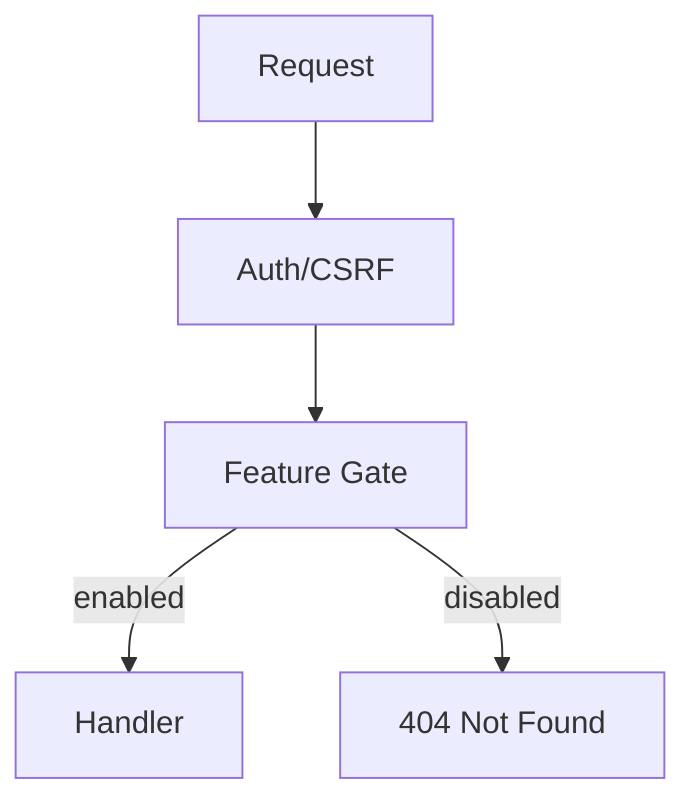

# 技术设计: 管理后台功能禁用（Feature Bans）

## 技术方案

### 核心技术
- Go（`net/http` + `http.ServeMux`）
- 既有配置机制：`app_settings`（管理后台 `/admin/settings` 写入，优先于配置文件默认）
- 既有模式：`self_mode`（自用模式，硬禁用一组功能域）

### 实现要点

1. **Feature 列表（显式枚举）**
   - 以“侧边栏功能项 + 对应路由组”为边界，枚举需要可禁用的功能域（用户侧与管理侧分别定义）。
   - 系统设置页（`/admin/settings`）**不进入**可禁用列表（硬规则）。

2. **持久化方式：复用 `app_settings`（推荐方案 1 的落地）**
   - 为每个功能域定义一个 `app_settings` key：`feature_disable_<name>`，值为 bool（`true` 表示禁用）。
   - 默认启用：当开关为“启用”时，**删除**该 key（保持 DB 干净，语义与现有 settings 一致）。
   - “恢复为配置文件默认”动作：统一删除全部 `feature_disable_*` keys（以及既有 settings keys）。

3. **有效状态计算（self_mode + UI 禁用）**
   - `effective_disabled(feature) = self_mode_hard_disabled(feature) OR app_settings_disabled(feature)`
   - `self_mode_hard_disabled(feature)` 负责把现有自用模式禁用项纳入同一套语义（例如 `billing`、`tickets` 等）。
   - UI 不允许打开 self_mode 的硬禁用项（页面展示为只读提示）。

4. **后端拒绝访问：路由级 Feature Gate**
   - 新增 middleware：`RequireFeature(feature)`。
   - 在 `internal/server/app.go` 组装路由时，为受控路由组挂载该 middleware；禁用时统一返回 404（与现有 self_mode 行为一致，且不暴露具体禁用原因）。
   - 对于 `POST` 的操作型路由同样挂载 middleware，避免“只禁页面不禁操作”。

5. **UI 入口隐藏：模板使用同一份 feature 状态**
   - 用户侧：`internal/web/templates/base.html`（以及必要入口页）根据 feature 状态隐藏菜单项与关键入口。
   - 管理侧：`internal/admin/templates/base.html` 同理隐藏菜单项（**系统设置始终展示**）。
   - 为避免在模板里写复杂逻辑，建议在 `TemplateData` 中提供一组明确的 boolean（或提供统一的 `Features` 结构/方法）。

## 架构设计

## 架构决策 ADR

### ADR-001: 使用 `app_settings` 存储 feature bans
**上下文:** 需要在运行时通过管理后台配置“禁用功能”，并持久化；项目已有 `app_settings` 与 `/admin/settings` 的读写模式。

**决策:** 使用 `app_settings` 存储 feature bans；每个 feature 一个 `feature_disable_<name>` bool key。

**理由:**
- 复用既有能力（读写、重置、UI 模式），实现成本最低
- 无需新增表/迁移，风险更小
- 语义清晰（禁用=存在且为 true；启用=删除 key）

**替代方案:** 新建 `feature_bans` 表（结构化更强） → 拒绝原因: 需要迁移与更多代码改动，当前需求优先“最小可落地”。

**影响:** `app_settings` 的 key 数量增加；需在文档中同步 key 列表与语义。

## 数据模型

在 `app_settings` 中新增（示例，最终以代码枚举为准）：

- `feature_disable_web_chat`
- `feature_disable_web_announcements`
- `feature_disable_web_tokens`
- `feature_disable_web_models`
- `feature_disable_web_usage`
- `feature_disable_billing`（涵盖订阅/充值/支付与相关 webhook）
- `feature_disable_tickets`
- `feature_disable_admin_channels`
- `feature_disable_admin_channel_groups`
- `feature_disable_admin_models`
- `feature_disable_admin_users`
- `feature_disable_admin_usage`
- `feature_disable_admin_announcements`

> 说明：`self_mode` 会对 `billing`、`tickets` 等做硬禁用；即使 DB 未配置，也视为禁用。

## 安全与性能

- **安全:**
  - 系统设置页不可禁用（UI 不提供、后端忽略）避免自锁。
  - Feature Gate 统一返回 404：与既有 `self_mode` 行为一致，并避免泄露禁用策略细节。
  - 所有写操作仍通过现有 `adminChain`（session + root + CSRF）保护。
- **性能:**
  - UI/管理后台路由 QPS 低，可接受按请求查询单个 `app_settings` key。
  - 若未来希望进一步降低 DB 压力，可为 feature 状态加一个短 TTL（如 3~10s）的内存缓存。

## 测试与部署

- **测试:**
  - middleware 单测：禁用时 404、启用时放行、自用模式硬禁用不触发 DB 读取。
  - 路由/集成测试：覆盖主要路由组（至少 billing/tickets/chat/announcements/admin-*）。
  - 回归：现有 `self_mode` 路由禁用测试保持通过。
- **部署:**
  - 无需数据库迁移（复用 `app_settings`）。
  - 发布后默认不禁用任何新增功能；管理员可在 `/admin/settings` 配置。
  - 救援：如误配置导致功能不可访问，可直接在数据库删除 `app_settings` 对应 `feature_disable_*` 记录。

