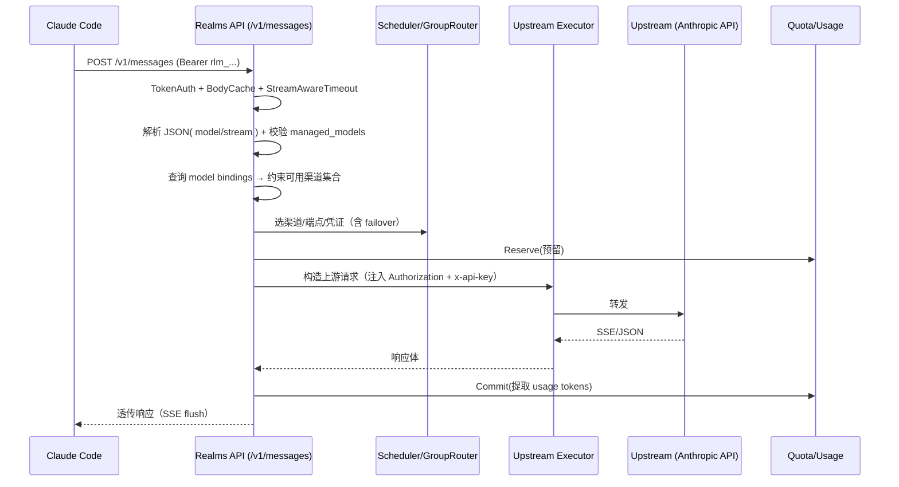

# 技术设计: Realms 接入 Claude Code（参考 claude-code-hub）

## 技术方案

### 参考项目 claude-code-hub 的实现拆解（按“功能→实现”）

> 目的：不是照抄技术栈（Next.js/Drizzle），而是抽取其“最小可用路径”与关键工程点，映射到 Realms 的 Go 架构。

1. 统一代理入口
   - claude-code-hub：用 Hono 把 `/v1/*` 全部交给一个 proxy handler；对外暴露一个 base URL。
   - Realms 对应：数据面同样以 `/v1/*` 为中心，但目前只实现了 `/v1/responses`、`/v1/chat/completions`、`/v1/models`。
   - 差异/结论：Realms 缺少 Claude Code 关键接口（最少 `POST /v1/messages`），需要补齐。

2. 鉴权（数据面）
   - claude-code-hub：接受 `Authorization: Bearer` 或 `x-api-key`；校验 API key→用户→权限。
   - Realms：`TokenAuth` 同样支持 Bearer/x-api-key；Token 仅存 hash；鉴权与并发限制更完备。
   - 差异/结论：无需重复造轮子，直接复用 Realms 的 middleware。

3. 上游选择（负载/粘性/故障切换）
   - claude-code-hub：provider 表 + weight 随机；“会话保持”用“同一个 key 最近一次请求的 provider”实现（启发式）。
   - Realms：三层调度 Channel→Endpoint→Credential，内置 affinity/binding/cooldown/RPM 等；并通过 group router 在组内做 failover。
   - 差异/结论：Realms 已经比参考实现更强；关键是为 Anthropic 请求建立“可用渠道集合”，避免误路由。

4. 用量/成本
   - claude-code-hub：从非流式 JSON / SSE message_delta 解析 usage → 查 model price 表 → 计算 cost_usd。
   - Realms：同样从非流式/SSE 解析 usage，并将成本估算委托给 `managed_models` 定价（支持倍率等）。
   - 差异/结论：只要 Anthropic 响应包含 usage（通常有 input/output tokens），Realms 的提取逻辑可直接复用；关键是“模型是否存在于 managed_models”（否则无法计费）。

5. 实时监控/可视化
   - claude-code-hub：基于 DB 聚合“活跃请求”（duration 为 null）与“最近请求”，并提供 dashboard UI。
   - Realms：已有用量、审计、上游健康等页面（更偏运维/商业化）。
   - 差异/结论：短期只需要补充 Claude Code 接入文档；监控复用现有用量页即可。

### 方案对比（复杂任务：2 个可行方案）

#### 方案 1（推荐）：在 Realms 内新增 Anthropic/Claude Code handler，复用既有模型/调度/计费链路

核心思路：
- 新增 `internal/api/anthropic`（或同级目录）实现 `POST /v1/messages`（可选补 `POST /v1/messages/count_tokens`）。
- 复用 `middleware.TokenAuth`、`scheduler`、`upstream.Executor`、`upstream.PumpSSE`、`quota.Provider`、`usage`/`audit`。
- 复用 “managed model + channel binding” 来定义：
  - 哪些模型对外可用（Public ID = Claude Code 发送的 model）
  - 每个模型可用哪些渠道（绑定筛选）
  - 不同渠道的上游模型名映射（payload 重写）

优点：
- 最少新增概念，不破坏现有 SSOT（managed_models）。
- 可计费、可限流、可审计、可 failover，与 Realms 当前工程标准一致。
- 风险可控：仅新增路由与 handler，executor 小改动。

缺点：
- 首次使用 Claude Code 前，需要管理员先配置 Claude 模型与渠道绑定（否则会触发“模型未启用/未绑定”的错误）。

#### 方案 2：引入“通用 /v1 透传代理模式”（更像 claude-code-hub），弱化 managed_models 约束

核心思路：
- 增加一个“通用透传 handler”，对未知 `/v1/*` 直接转发。
- 不强制 managed_models 存在；当 model 未配置时按默认成本/0 成本处理。

优点：
- Claude Code 上手更快，接近 claude-code-hub 的“配好 provider 就能用”体验。

缺点（致命）：
- 与 Realms 当前的计费/配额模型冲突：未知模型无法精确定价，会导致成本/配额不可控。
- 透传范围扩大，错误面更大（虽然 base_url 有 SSRF 校验，但语义边界变宽）。

结论：除非你的实际业务明确“不需要计费/严格配额”，否则不建议走方案 2。

本方案选择：方案 1。

## 架构设计

### 数据面请求链路（方案 1）

## API 设计（新增）

### [POST] /v1/messages
- **描述:** Anthropic Messages API 兼容入口（供 Claude Code 使用）
- **认证:** 复用 Realms 数据面 Token（Bearer / x-api-key）
- **行为:**
  - 非流式：完整透传响应，并从 JSON 中提取 usage
  - 流式：SSE 逐事件透传，并从 `data:` JSON 中提取 usage（尽力而为）

### [POST] /v1/messages/count_tokens（可选）
- **描述:** 若 Claude Code/SDK 实际调用该接口，则补齐透传
- **说明:** 可先不实现，等观测到真实调用再补

## 关键实现要点（按文件/模块）

1. `internal/server/app.go`
   - 新增路由：
     - `POST /v1/messages`
     - （可选）`POST /v1/messages/count_tokens`
   - 走同一条 `apiChain`（TokenAuth/限流/BodyCache/超时），保持行为一致。

2. `internal/api/anthropic/handler.go`（新增）
   - 结构基本可复用 `internal/api/openai/handler.go` 的骨架：
     - 解析 body（JSON）
     - 提取 `model` 与 `stream`
     - 查询 managed model 是否启用
     - 查询 channel-model bindings 并构造 `AllowChannelIDs`
     - 按 selection 重写 payload.model（上游模型名）
     - 使用 `GroupRouter.Next()` + `tryWithSelection()` 完成 failover
     - SSE 分支：`upstream.PumpSSE` + OnData 提取 usage
     - 非 SSE 分支：读取响应 body 提取 usage
   - 兼容点：
     - Anthropic 的 `max_tokens` 与 OpenAI 的字段不同：不在服务端强行改写，避免与客户端行为冲突。

3. `internal/upstream/executor.go`
   - 流式识别：将 `/v1/messages` 纳入 `isStreamRequest`（避免对 stream 请求套上 upstreamTimeout）。
   - 鉴权 header：在 `CredentialTypeOpenAI` 路径下，同时设置：
     - `Authorization: Bearer <upstreamKey>`
     - `x-api-key: <upstreamKey>`
     - 维持 `Accept-Encoding: identity`（避免 gzip 干扰流式）
   - 保持“下游鉴权 header 不上送”的安全边界。

4. `internal/web/templates/*` + `README.md`
   - 增加 Claude Code 的配置示例：
     - `~/.claude/settings.json`
     - `ANTHROPIC_BASE_URL`
     - `ANTHROPIC_AUTH_TOKEN`
   - 明确“Claude 模型需在 Realms 中启用并绑定渠道”的前置条件（方案 1 的关键）。

## 安全与性能

- 安全
  - 继续依赖现有 SSRF 防护：仅允许管理员配置的上游 base_url，且 base_url 校验在 executor 中统一完成。
  - 不扩大透传范围：只新增 Claude Code 必需接口，不做全量 `/v1/*` catch-all（避免语义边界变宽）。
  - 上游鉴权不复用下游 token：始终用上游 credential 注入。

- 性能
  - SSE 使用 `PumpSSE` 逐事件 flush，避免“读完再写回”造成的假流式与高内存占用。
  - usage 提取在 OnData 中做“包含 usage 关键词才解析 JSON”的优化策略（可直接复用现有实现思路）。

## 测试与部署

- 测试
  - 单测：handler 的 model 解析、bindings 约束、payload 重写、stream/non-stream 分支。
  - SSE 测试：用 httptest 模拟上游 event-stream，验证 `PumpSSE` 透传与 usage 提取（尽力而为）。
  - 回归：`go test ./...`，重点覆盖 openai handler 与 executor 的改动风险。

- 部署
  - 不新增外部依赖；沿用现有 Docker/MySQL 部署。
  - 若要对 Claude Code 提供独立入口域名，可在反向代理层做 host 区分（可选）。

