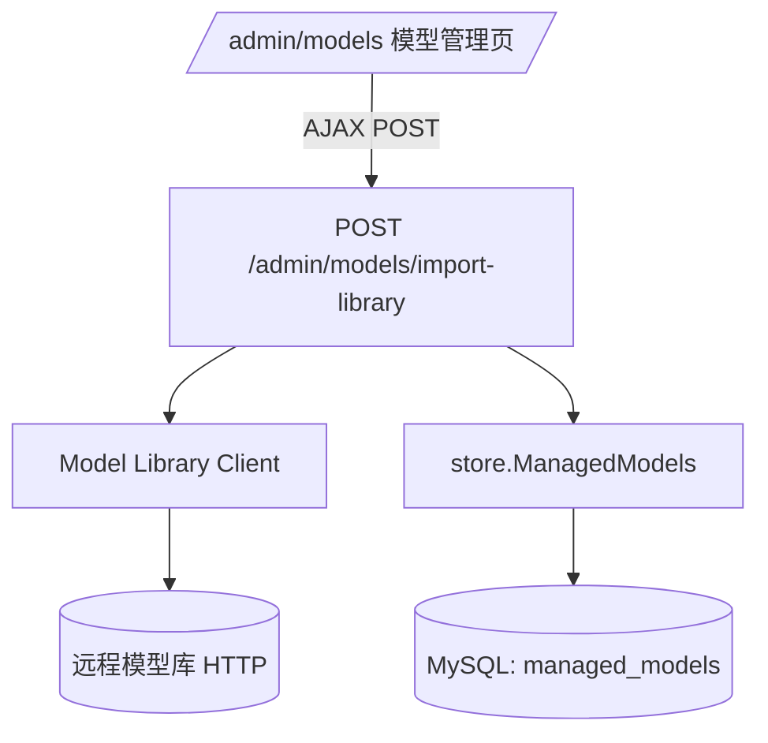

# 变更提案: model-library-import

## 元信息
```yaml
类型: 新功能
方案类型: implementation
优先级: P1
状态: 草稿
创建: 2026-01-22
```

---

## 1. 需求

### 背景
当前模型目录（`managed_models`）需要管理员在管理后台 `/admin/models` 手动维护：对外 `public_id`、价格（input/output/cache）与展示用 `owned_by`。  
虽然已有“导入价格表”（上传 JSON 或粘贴 JSON），但无法从远程“模型库”按 `model_id` 直接查询并导入/更新模型信息，容易出现：

- 价格手动录入出错（影响计费/配额）
- `owned_by` 缺失导致 UI 图标映射不准（当前图标来自 `internal/icons/ModelIconURL`，优先用 `owned_by`，缺失时才回退 model_id 规则）
- 多环境（dev/staging/prod）模型信息漂移

### 目标
- 在管理后台现有“模型管理”页面（`/admin/models`）的 **“新增模型”弹窗** 增强“从模型库查询并填充字段”能力：管理员输入 `model_id` → 系统从远程模型库查询 → **自动填充新增模型表单字段**（价格 + owned_by；图标按现有规则即时预览）。
- 对“新增模型/编辑模型/导入价格表”保持兼容：新能力是补充工具，不替代现有维护方式。

### 约束条件
```yaml
时间约束: 无硬性截止（建议先做最小可用版本）
性能约束: 单次查询应在可控超时内完成（默认 3-10s 可配置），失败需有明确提示
兼容性约束: 仅改动管理后台与模型目录写入逻辑，不影响数据面请求转发；不要求前端 SPA，引入最小 JS
业务约束: 导入不会默认“自动启用模型”（避免误开放）；是否覆盖已有价格/owned_by 需要可控
```

### 验收标准
- [ ] 在“新增模型”弹窗中，输入 `model_id` 点击“从模型库查询”，可自动填充 `input_usd_per_1m/output_usd_per_1m/cache_input_usd_per_1m/cache_output_usd_per_1m/owned_by`
- [ ] 查询成功后可在弹窗内预览图标（沿用 `modelIconURL(model_id, owned_by)` 规则），管理员仍可手动调整后再保存创建
- [ ] 远程不可用/未找到/鉴权失败时，管理后台展示可读的错误信息（不泄露密钥）
- [ ] 保存创建仍走现有 `POST /admin/models`；不要求新增 `/v1/models` 相关能力

---

## 2. 方案

### 技术方案
在现有 SSR 管理后台体系中增加一个“按 model_id 远程查询 → 填充新增模型表单”的闭环：

1) 新增 **Model Library Client**（HTTP）：负责按 `model_id` 调用远程模型库接口并解析响应  
2) 新增 **Admin 查询接口**：`POST /admin/models/library-lookup`（AJAX），调用 client → 返回可用于“新增模型”表单的字段（不直接写库）  
3) 更新 **管理后台模板** `internal/admin/templates/models.html`：在“新增模型”弹窗中新增“从模型库查询”区块（输入 model_id、点击查询后填充表单）  
4) 可选：复用现有定价解析逻辑（`parsePricingFromMap`），兼容 `usd_per_1m` 与 `cost_per_token` 两种常见价格表示  

> 备注：如果后续确实需要“一键写入/更新 managed_models”，可在第二阶段追加 `POST /admin/models/import-library`（写库型接口），但不作为本次最小交付。

### 数据源选择（GitHub 上可直接复用的“模型库”）

本需求“新增模型时自动填充字段”的关键是：**要有一个可公开访问、可长期维护、且字段覆盖价格/归属方/缓存价格的模型目录数据源**。  
调研后，GitHub 上有 2 个非常贴合的现成来源（可二选一或做优先级 fallback）：

1) **models.dev（推荐，开源数据库）**  
   - repo：`anomalyco/models.dev`  
   - 特点：以 TOML 维护，提供 `https://models.dev/api.json` 聚合 API，字段天然是 **USD/1M tokens**（含 cache_read/cache_write）且有 provider ID 与 provider logo。  
   - 映射到 Realms：
     - `owned_by` ← provider（如 openai / anthropic / google）
     - `input_usd_per_1m` ← `cost.input`
     - `output_usd_per_1m` ← `cost.output`
     - `cache_input_usd_per_1m` / `cache_output_usd_per_1m` ← `cost.cache_read`（models.dev 目前仅提供 cache_read；Realms 默认同价填充两列）
   - 重要说明：models.dev 同一个 `model_id` 可能出现在多个 provider 下（如 `gpt-4o` 同时存在于 openai/azure 等）。实现侧会按模型名启发式优先选择品牌 provider（例如 `gpt-*` → openai、`claude-*` → anthropic、`gemini-*` → google）；若仍无法判定，则返回“候选 provider 列表”，管理员可改用 `provider/model_id`（如 `openai/gpt-4o`）明确指定。

2) **LiteLLM 模型目录（成熟生态文件）**  
   - repo：`BerriAI/litellm`（`model_prices_and_context_window.json`）  
   - 特点：JSON 维护，字段常见为 `input_cost_per_token/output_cost_per_token/cache_read_*`，需要换算成 USD/1M token；Realms 已有同类解析逻辑（导入价格表时已支持）。

> 备注：无论选择哪个数据源，管理后台都保留“手动编辑”作为兜底；远程失败时不影响保存流程。

### 影响范围
```yaml
涉及模块:
  - internal/admin: 增加导入 handler + 模板 UI
  - internal/server: 注册新的 admin 路由
  - internal/config: 增加模型库配置（base_url/token/timeout）
  - internal/store: 复用现有 managed_models 的 CRUD（必要时补充 upsert 辅助）
  - internal/icons: 无需改动（图标已支持按 owned_by/model_id 映射）
预计变更文件: 8-12
```

### 风险评估
| 风险 | 等级 | 应对 |
|------|------|------|
| 价格导入错误影响计费/配额 | 高 | 默认不自动启用；提供“覆盖/不覆盖”选项；对价格做非负校验并统一单位（USD/1M token） |
| 远程模型库不稳定/超时 | 中 | HTTP 超时可配置；失败时返回可读错误；不阻塞现有手动维护流程 |
| 远程鉴权信息泄露 | 中 | 不在响应/日志输出密钥；错误信息裁剪；仅 root 可操作（沿用现有 admin 链） |
| 响应格式变更导致解析失败 | 中 | 以“明确约定的 JSON schema”为准；必要时增加兼容字段映射并编写单测 |

---

## 3. 技术设计（可选）

> 涉及架构变更、API设计、数据模型变更时填写

### 架构设计


### API设计
#### POST /admin/models/library-lookup
- **请求（Form）**
  - `model_id`: string（必填）
- **响应（JSON，沿用现有 AJAX 规范）**
  - 成功：`{"ok":true,"notice":"...","data":{...}}`（data 内包含 owned_by 与三种价格字段）  
  - 失败：`{"ok":false,"error":"..."}`

### 数据模型
| 字段 | 类型 | 说明 |
|------|------|------|
| managed_models.public_id | VARCHAR(128) | 对外模型 ID（管理员输入/模型库返回） |
| managed_models.owned_by | VARCHAR(64) NULL | 展示用归属方（用于图标映射与 /v1/models owned_by） |
| managed_models.input_usd_per_1m | DECIMAL(20,6) | 输入价格（USD/1M token） |
| managed_models.output_usd_per_1m | DECIMAL(20,6) | 输出价格（USD/1M token） |
| managed_models.cache_input_usd_per_1m | DECIMAL(20,6) | 缓存命中输入价格（USD/1M token） |
| managed_models.cache_output_usd_per_1m | DECIMAL(20,6) | 缓存命中输出价格（USD/1M token） |
| managed_models.status | TINYINT | 是否启用（默认导入不自动启用） |

> 备注：当前 UI 中“图标”不存表，使用 `internal/icons/ModelIconURL(model_id, owned_by)` 动态映射到 CDN 图标。

---

## 4. 核心场景

> 执行完成后同步到对应模块文档

### 场景: 管理员按 model_id 导入新模型
**模块**: internal/admin + internal/store  
**条件**: 管理员在 `/admin/models` 打开“新增模型”弹窗，输入 `model_id` 并点击“从模型库查询”  
**行为**: 后端请求远程模型库，解析价格/owned_by，返回给前端；前端将值写入表单 input  
**结果**: 管理员可以基于填充结果调整字段并点击“保存”，成功创建后列表展示该模型与价格/归属方；图标按 owned_by/model_id 映射显示

### 场景: 更新已有模型（不改变启用状态）
**模块**: internal/admin + internal/store  
**条件**: 本地 `managed_models` 已存在该 `public_id`  
**行为**: 本次仅做“查询并填充新增表单”；如需“编辑页一键更新”，作为后续迭代新增按钮与写入策略  
**结果**: 避免误启用/误禁用；管理员仍可在编辑页手动调整或使用价格导入功能

### 场景: 远程模型库不可用/无该模型
**模块**: internal/admin + internal/modellibrary  
**条件**: 远程超时/返回 404/鉴权失败  
**行为**: 导入接口返回明确错误（不泄露密钥）  
**结果**: 管理员可改用“新增模型/导入价格表”继续维护

---

## 5. 技术决策

> 本方案涉及的技术决策，归档后成为决策的唯一完整记录

### model-library-import#D001: 导入写入策略（覆盖范围与启用状态）
**日期**: 2026-01-22
**状态**: ⏸搁置
**背景**: 目前用户需求指向“新增模型表单字段填充”，此时不直接写库；但若后续要支持“编辑页一键写库更新”，需要明确覆盖范围与启用状态策略，避免误开放模型。
**选项分析**:
| 选项 | 优点 | 缺点 |
|------|------|------|
| A: 仅提供 lookup（填充表单，不写库） | 满足新增模型场景；风险最低 | 不解决“更新已有模型” |
| B: lookup + “编辑页一键更新”（写库，但保持 status 不变） | 同步更省事 | 可能覆盖手工微调，需要 override 选项 |
| C: lookup + 写库更新，提供 override/enable 明确选项 | 兼顾安全与效率 | UI/实现更复杂 |
**决策**: 先落地 A；后续如需要再在 B/C 中选择
**理由**: 当前用户明确指向“新增模型模板字段”，先做最小闭环能最快交付；写库更新作为可选增强。
**影响**: internal/admin（新增弹窗字段填充）、internal/config（模型库配置）、internal/modellibrary（client）
