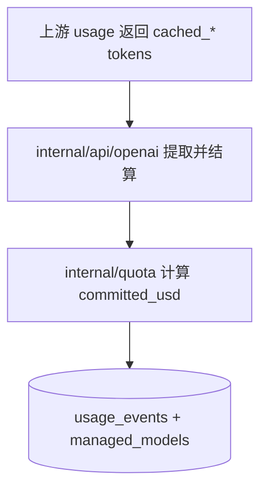

# 变更提案: cached-tokens-pricing-split

## 元信息
```yaml
类型: 变更
方案类型: implementation
优先级: P1
状态: 已完成
创建: 2026-01-22
```

---

## 1. 需求

### 背景
变更前 `managed_models` 仅支持单一缓存单价 `cache_usd_per_1m`，并在计费时将 `cached_input_tokens + cached_output_tokens` 合并按同一单价结算（见 `internal/quota/quota.go:estimateCostUSD`）。

但上游 usage 统计里缓存命中被拆分为 **缓存输入** 与 **缓存输出**（数据库字段也已拆分：`usage_events.cached_input_tokens`、`usage_events.cached_output_tokens`），在需要更精细的成本核算/定价策略时，单一缓存单价无法满足：
- 需要分别设置缓存输入/缓存输出单价
- 计费仍需保持“缓存 tokens 是总 tokens 子集”的裁剪语义，避免重复计费或负值

### 目标
- 将模型定价从 `cache_usd_per_1m` 拆分为：
  - `cache_input_usd_per_1m`
  - `cache_output_usd_per_1m`
- 计费逻辑按“子集裁剪 + 差额计费”执行：
  - `cached_input_tokens <= input_tokens`
  - `cached_output_tokens <= output_tokens`
  - 非缓存部分按 input/output 单价计费；缓存部分分别按 cache_input/cache_output 单价计费
- 保持现有 cached token 提取与落库逻辑不变（仍来自上游 usage）

### 约束条件
```yaml
时间约束: 无
性能约束: 计费计算为纯内存运算，复杂度不增加（仍为 O(1)）
兼容性约束: 本次不保持旧字段兼容（移除 cache_usd_per_1m，统一使用新字段）
业务约束: 子集裁剪语义必须保留；cached_output_tokens 需要参与计费（缺省视为 0）
```

### 验收标准
- [√] managed_models 增加 `cache_input_usd_per_1m`、`cache_output_usd_per_1m`，并移除 `cache_usd_per_1m`
- [√] 管理后台 `/admin/models` 新增/编辑模型时可分别录入缓存输入/缓存输出单价
- [√] `estimateCostUSD` 使用四段计费（non-cached input / non-cached output / cached input / cached output），并对 cached tokens 做子集裁剪
- [√] 覆盖单测：包含 cached_output_tokens 的计费、cached tokens 超出总 tokens 时裁剪、精度截断到 6 位小数
- [√] `go test ./...` 通过

---

## 2. 方案

### 技术方案
1) 数据库迁移（新增列 + 回填 + 删除旧列）
- 在 `managed_models` 增加：
  - `cache_input_usd_per_1m DECIMAL(20,6) NOT NULL`
  - `cache_output_usd_per_1m DECIMAL(20,6) NOT NULL`
- 用旧列 `cache_usd_per_1m` 回填新列（两列均设置为旧值）
- 删除旧列 `cache_usd_per_1m`

2) Store/Model 层改造
- `store.ManagedModel`、`internal/store/managed_models.go` 等读取/写入 SQL 全量切换到新字段
- 管理后台的导入/导出结构同步更新（JSON 字段名与表字段一致）

3) 计费逻辑改造
- `internal/quota/quota.go:estimateCostUSD` 改为分别按 cache_input/cache_output 单价计算缓存部分
- 保持现有“子集裁剪”与“最终截断到 6 位小数”规则

4) 管理后台 UI 改造
- `/admin/models` 新增模型/编辑模型表单增加两个输入框
- “导入价格表”示例 JSON 更新为新字段
- models.dev 查询填充（如使用）同步填充两个字段（默认用同一缓存读单价填充两列，后续可人工调整）

### 影响范围
```yaml
涉及模块:
  - internal/store: managed_models 结构与 SQL 查询更新
  - internal/quota: 计费公式更新
  - internal/admin: 管理后台模型表单与导入逻辑更新
  - internal/web: 模型价格展示字段更新（如有）
  - internal/modellibrary: models.dev 查询结果字段更新（如有）
预计变更文件: 10-18
```

### 风险评估
| 风险 | 等级 | 应对 |
|------|------|------|
| 迁移导致模型缓存价格丢失/不一致 | 中 | 迁移时先回填两列再删旧列；用默认值兜底 |
| 计费口径变化导致账单波动 | 中 | 迁移默认两列取旧值，保持与旧口径一致；单测覆盖关键边界 |
| UI/导入字段变更影响管理员操作 | 低 | 更新表单与示例 JSON；必要时在表单提示含义 |

---

## 3. 技术设计（可选）

> 涉及架构变更、API设计、数据模型变更时填写

### 架构设计


### API设计
无新增北向 API；仅涉及后台表单字段与内部计费逻辑调整。

### 数据模型
| 字段 | 类型 | 说明 |
|------|------|------|
| managed_models.cache_input_usd_per_1m | DECIMAL(20,6) | 缓存输入命中单价（USD/1M tokens） |
| managed_models.cache_output_usd_per_1m | DECIMAL(20,6) | 缓存输出命中单价（USD/1M tokens） |

---

## 4. 核心场景

> 执行完成后同步到对应模块文档

### 场景: 结算时分别计费缓存输入/缓存输出
**模块**: internal/quota  
**条件**: usage 中同时存在 `cached_input_tokens` 与/或 `cached_output_tokens`  
**行为**: 对 cached tokens 做子集裁剪后，分别按 `cache_input_usd_per_1m`、`cache_output_usd_per_1m` 计费  
**结果**: committed_usd 反映缓存输入与缓存输出的不同单价

---

## 5. 技术决策

> 本方案涉及的技术决策，归档后成为决策的唯一完整记录

### cached-tokens-pricing-split#D001: managed_models 缓存单价字段拆分与迁移策略
**日期**: 2026-01-22
**状态**: ✅采纳
**背景**: 需要分别设置缓存输入/缓存输出单价，同时尽量保持现有计费口径在默认情况下不变。
**选项分析**:
| 选项 | 优点 | 缺点 |
|------|------|------|
| A: 保留 `cache_usd_per_1m`，新增两列并继续沿用旧列 | 改动小 | 字段语义混乱，长期维护成本高 |
| B: 新增两列并删除旧列（迁移回填） | 语义清晰；默认口径可保持一致 | 需要迁移，改动面更大 |
**决策**: 选择方案 B
**理由**: 本次需求明确要“手动分别定价”，保留旧列会造成歧义与重复来源；迁移回填可最大化降低行为变化风险。
**影响**: internal/store、internal/admin、internal/quota、相关模板与单测
