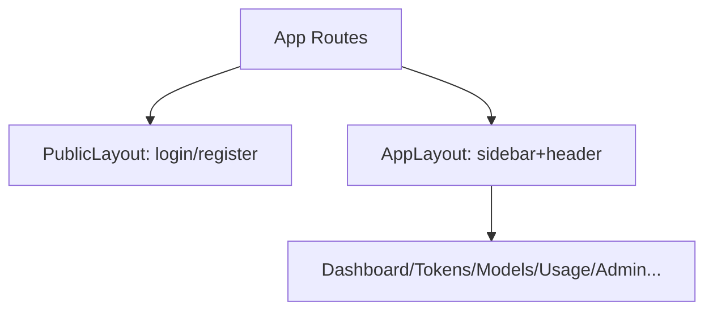

# 变更提案: spa-style-restore

## 元信息
```yaml
类型: 修复
方案类型: implementation
优先级: P1
状态: 草稿
创建: 2026-01-30
```

---

## 1. 需求

### 背景
Realms 已完成与 `new-api` 的前后端分离对齐（见 `helloagents/plan/202601292015_frontend-backend-separation/`），当前 UI 由 `web/`（Vite + React SPA）接管，后端仅提供 `/api/*` 与 SPA fallback。

对齐后带来的副作用是：历史版本中 SSR（`internal/web/templates/*`、`internal/admin/templates/*`）所使用的 Bootstrap + 渐变背景 + 侧边栏布局的视觉样式不再生效，SPA 目前为临时的 `rlm-*` 暗色样式与大量 inline style，整体体验与此前不一致。

旧样式基线（SSOT）：
- Git tag: `0.3.3`（指向 commit `19d139f35b1bb31e351bbe01b44f7e36290c3001`，日期 2026-01-29）
- 核心样式来源文件：`internal/web/templates/base.html`、`internal/admin/templates/base.html`

### 目标
将“旧版 Realms 的 Web 视觉风格”恢复并应用到当前 SPA，覆盖所有前端页面（用户侧 + 管理侧），使对齐 `new-api` 后的 UI 仍保持原先的品牌观感与可用性。

### 约束条件
```yaml
时间约束: 无硬性时间约束（优先保证一致性与可维护性）
性能约束: 避免引入明显的首屏阻塞与巨量依赖；不改变现有 API 调用与路由行为
兼容性约束: 以 tag 0.3.3 的 SSR 模板视觉为准（Bootstrap 5 风格、字体与布局），并保持移动端可用
业务约束: 仅做样式与布局恢复，不改变鉴权/权限逻辑与接口语义
交付约束: 无需离线化（允许继续使用 CDN 引入 Bootstrap/字体/图标）
布局约束: 登录后布局需完全复刻 0.3.3（sidebar + top-header + content-scrollable）；Admin 与用户侧共用同一套布局
范围约束: 仅覆盖当前 SPA 已存在路由（不补回旧 SSR 的 /account、/announcements、/subscription 等页面；技术站/文档站不在本次范围）
```

### 验收标准
- [ ] SPA 页面（`/login`、`/register`、`/dashboard`、`/tokens`、`/models`、`/usage`、`/admin/*`）统一使用“旧版 Realms”视觉风格（渐变背景、卡片风格、字体、颜色基调一致），不再出现未样式化页面
- [ ] 登录后页面具备统一的应用布局（侧边栏 + 顶栏 + 可滚动内容区），结构与 0.3.3 一致，并能正确高亮当前导航项
- [ ] 移动端可正常使用（侧边栏可展开/收起，不遮挡内容）
- [ ] `web/` 前端构建通过（`npm run lint`、`npm run build`）

---

## 2. 方案

### 技术方案
1) **以 SSR 模板为样式来源**：提取/复用 `internal/web/templates/base.html` 与 `internal/admin/templates/base.html` 中的全局样式（字体、CSS 变量、布局类、卡片/表单/表格的视觉基调），迁移到 SPA（`web/`）中。
2) **引入统一布局组件**：为 SPA 增加 `AppLayout`（sidebar + top-header + content-scrollable），并将各页面改造为“内容组件”，由布局统一承载导航与用户信息（Admin 与用户侧共用同一套布局）。
3) **页面逐步替换旧 `rlm-*` 样式**：将现有页面中的 `rlm-*` class 与 inline style 重构为 Bootstrap 风格的结构（`card`/`btn`/`form-control`/`table` 等）与少量自定义 CSS（用于侧边栏与背景等品牌化部分）。

> 说明：本变更优先恢复“观感与布局一致性”。交互细节（例如卡片内的更复杂组件）可在后续迭代中继续精细化。

### 影响范围
```yaml
涉及模块:
  - Web SPA (web/): 全局样式、布局组件、页面结构与样式重构
  - 参考来源 (internal/web, internal/admin): 仅作为样式参考，不修改其行为
预计变更文件: 10-20（以 web/ 内文件为主）
```

### 风险评估
| 风险 | 等级 | 应对 |
|------|------|------|
| 全局样式变更导致局部页面错位/可读性下降 | 中 | 先落地统一布局与基础控件样式；逐页校验（login/register/dashboard/tokens/models/usage/admin）并在任务清单中加入验证项 |
| 依赖引入方式（CDN vs bundling）影响部署可用性 | 中 | 在技术决策中明确；优先对齐仓库历史实现（SSR 使用 CDN），如需离线化可在后续改为 npm bundling |
| 路由/权限误改导致页面不可达 | 低 | 严格限制为 UI 层改动；路由行为保持不变；完成后通过登录-跳转-登出链路验证 |

---

## 3. 技术设计（可选）

本次不涉及后端 API 与数据模型变更，仅新增/调整前端布局与样式组织方式。

### 组件结构（拟）


---

## 4. 核心场景

> 执行完成后同步到对应模块文档

### 场景: 访问登录页
**模块**: Web SPA（`web/`）
**条件**: 未登录
**行为**: 打开 `/login`，使用账号密码登录
**结果**: 页面使用统一视觉风格；登录成功后进入 `/dashboard` 并展示带侧边栏的应用布局

### 场景: 浏览控制台与管理页
**模块**: Web SPA（`web/`）
**条件**: 已登录（普通用户/管理员）
**行为**: 在侧边栏切换 `/dashboard`、`/tokens`、`/models`、`/usage`、`/admin/*`
**结果**: 页面布局稳定、导航高亮正确、移动端可用

---

## 5. 技术决策

> 本方案涉及的技术决策，归档后成为决策的唯一完整记录

### spa-style-restore#D001: SPA 样式恢复策略（Bootstrap 复用方式）
**日期**: 2026-01-30
**状态**: ✅采纳
**背景**: 旧版 Realms 的视觉主要基于 Bootstrap 5 + 少量自定义 CSS（布局/背景/字体）。SPA 需要在“恢复一致性”与“部署可靠性/依赖可控”之间取舍。
**选项分析**:
| 选项 | 优点 | 缺点 |
|------|------|------|
| A: 在 `web/index.html` 继续使用 CDN 引入 Bootstrap/字体/图标（对齐历史 SSR） | 改动最小、快速还原观感、与历史模板一致 | 依赖外网资源（受网络/地区限制） |
| B: 通过 npm 安装并打包 Bootstrap（字体/图标仍可后续离线化） | 部署更稳定、可 embed 分发 | 初期改动略多，需要处理构建链路与 CSS 组织 |
**决策**: 选择方案 A（先恢复一致性），并在任务清单中预留“可选的离线化/打包改造”作为后续迭代点。
**理由**: 本需求核心是“样式恢复”，且已确认“无需离线化”。仓库历史 SSR 已采用 CDN；先按历史约定快速恢复 UI，再按需要推进依赖打包。
**影响**: `web/index.html`、`web/src/index.css`（或新增全局样式文件）、前端页面结构与 class 命名

### spa-style-restore#D002: 复刻范围与布局策略
**日期**: 2026-01-30
**状态**: ✅采纳
**背景**: SPA 与旧 SSR 的页面集合不同；需要明确“全量复刻”的边界，避免引入超出当前需求的新页面与业务逻辑。
**选项分析**:
| 选项 | 优点 | 缺点 |
|------|------|------|
| A: 仅对齐视觉基调，允许简化布局 | 改动少、见效快 | 容易“像但不一样”，无法满足“完全复刻”的预期 |
| B: 登录后布局与 0.3.3 完全一致，页面范围仅限现有 SPA 路由 | 观感与交互一致、边界清晰 | 页面重构量更大，需要引入统一布局组件 |
**决策**: 选择方案 B
**理由**: 已确认“完全复刻”“Admin 共用布局”“按现有路由范围”。技术站/文档站已重写，不在本次范围。
**影响**: `web/src/App.tsx`（路由组织）、`web/src/layout/*`（新增）、各 `web/src/pages/*`（结构调整）
