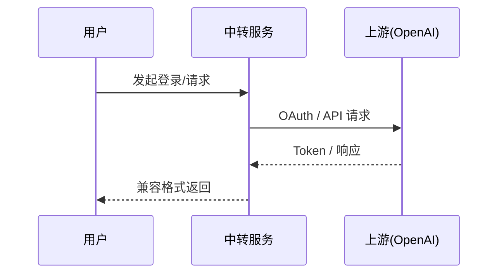

# 架构设计

## 总体架构（当前实现，MVP）

```mermaid
flowchart TD
    Client[客户端 / Codex CLI / SDK] --> Realms[Realms 服务\n(OpenAI 兼容 /v1)]
    Realms --> Auth[下游鉴权]
    Realms --> Router[路由与调度\nChannel→Endpoint(单)→Credential]
    Router --> Exec[Upstream Executor]
    Exec --> OpenAI[OpenAI 兼容上游\n(自定义 baseUrl)]
    Exec --> CodexUp[Codex OAuth 上游\nchatgpt.com/backend-api/codex]
    Realms --> Store[MySQL 存储\n(Token/Session hash；上游凭据明文入库)]
    Realms --> Obs[日志/指标/追踪\n(可选 OTel)]
```

## 技术栈（当前实现）

- **后端:** Go（优先 `net/http`，依赖最小）
- **存储:** MySQL（Token/Session hash；上游凭据明文入库）

## 核心流程（当前实现）



## 产品形态（双形态）

Realms 支持同一套代码覆盖两种主要形态：

- **自用形态（self_mode.enable=true）**
  - 目标：聚焦多上游管理与稳定转发，降低暴露面与运维负担。
  - 行为：计费/支付/工单相关入口被强制关闭（路由不注册 + FeatureGateEffective 兜底 + UI 隐藏）。
- **商业形态（self_mode.enable=false）**
  - 目标：支持订阅/余额/支付/工单等完整域（按需开启）。
  - 行为：功能入口主要受 `feature_disable_*` 控制（隐藏 UI + 路由 404），计费策略由 billing/policy 配置决定。

## 重大架构决策

正式 ADR 以最新方案包为准：
- `helloagents/history/2026-01/202601131914_codex/how.md`

| adr_id | title | date | status | affected_modules | details |
|--------|-------|------|--------|------------------|---------|
| ADR-001 | 单服务 realms 收敛 | 2026-01-13 | ✅已实现（MVP） | realms | [history/2026-01/202601131914_codex/how.md](../history/2026-01/202601131914_codex/how.md) |
| ADR-002 | 北向接口以 OpenAI 兼容为主 | 2026-01-13 | ✅已实现（MVP） | realms | [history/2026-01/202601131914_codex/how.md](../history/2026-01/202601131914_codex/how.md) |
| ADR-003 | 三层 failover（Channel→Endpoint→Credential） | 2026-01-13 | 🚧部分实现 | realms | [history/2026-01/202601131914_codex/how.md](../history/2026-01/202601131914_codex/how.md) |
| ADR-004 | SSE 写回后禁止 failover | 2026-01-13 | ✅已实现（MVP） | realms | [history/2026-01/202601131914_codex/how.md](../history/2026-01/202601131914_codex/how.md) |
| ADR-005 | 上游类型与合规边界 | 2026-01-13 | ✅已实现（MVP） | realms | [history/2026-01/202601131914_codex/how.md](../history/2026-01/202601131914_codex/how.md) |
| ADR-006 | 双形态开关与功能域隔离（self_mode + feature gates） | 2026-01-20 | ✅已实现（自用模式硬化） | server/web/admin/store | [history/2026-01/202601202039_self_mode_upstreams/how.md](../history/2026-01/202601202039_self_mode_upstreams/how.md) |

## 代码入口（实现）

- 启动入口：`cmd/realms/main.go`
- HTTP 组装：`internal/server/app.go`
- 数据面：`internal/api/openai/handler.go`
- 调度器：`internal/scheduler/*`
- 上游执行器：`internal/upstream/*`
- 存储与迁移：`internal/store/*`
